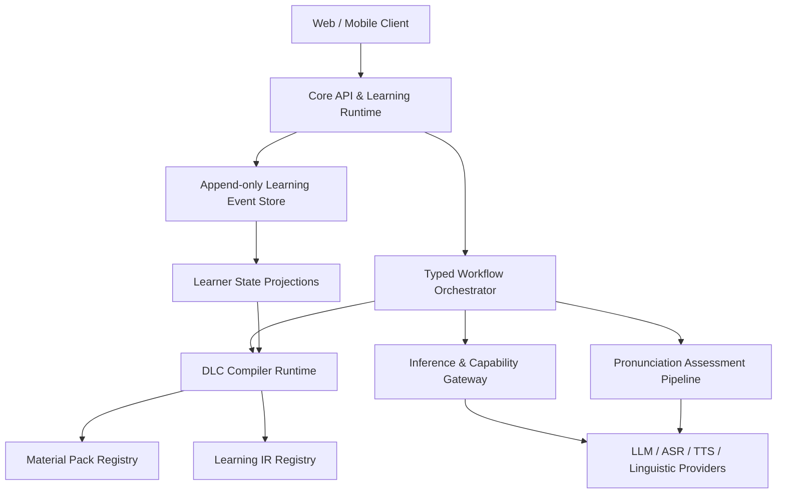
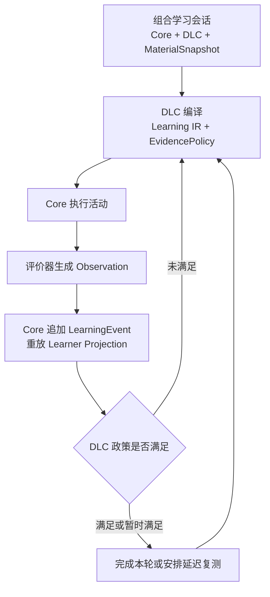
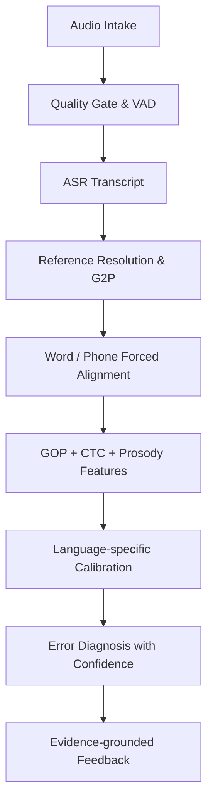

# 语言学习编译平台：系统架构与发音评测基线

> 文档状态：`BASELINE / ACCEPTED`
> 版本：`0.2.0`
> 日期：`2026-08-15`  
> 用途：作为产品、架构、DLC、素材、Agent、模型与语音系统的第一份统一事实来源。后续实现可以修改，但修改必须通过 ADR 记录，不允许开发 Agent 在任务中自行改变本文件中的架构基线。
>
> **v0.2.0 为破坏性升级**（Human 2026-08-15 批准，依据 `docs/V1_REVISE_LEARNING_STATE_ZH.md` 与 `docs/LLOS_TRAE_HANDOFF_LEARNING_LOOP_AND_8_ISSUES_ZH.md`）：新增会话模式与三层就绪门（§2.6）、素材来源与 MaterialSnapshot（§2.7）、DLC 沙箱与失败语义（§2.8）、证据中心学习状态闭环（§5）、学习事件注册表与 Evidence Policy（§5.3/§5.5）；Learning IR 去除固定语言学枚举，改为 claim/policy 引用与闭合运行原语（§4）；ADR-009 适用范围收窄为未来公开分发阶段，新增 ADR-010/011/012。全部契约 schema 同步升至 0.2.0。

---

## 0. 执行摘要

本项目不是“聊天机器人加课程库”，也不是“多个 Agent 互相讨论后生成课程”。本项目是一套**语言学习编译平台**：

- **Core** 是特权运行时、协议宿主、账户与学习状态的事实来源；
- **DLC** 是教学编译器，将素材、学习者状态和教学目标转换为可执行学习程序；
- **Material Pack** 是可被不同教学编译器消费的素材源；
- **Learning IR** 是 Core、DLC、素材和运行时之间的稳定 ABI；
- **Agent** 只处理确实需要概率推理的有界任务；
- **ASR、TTS、发音对齐、音素评分和韵律分析是能力服务，不是 Agent**；
- **模型是 Provider，不是架构**；
- **学习事件是事实，模型输出不是事实**；
- **所有评价必须给出证据、置信度和可弃权状态**；
- **学习是 Core、DLC、素材层三层协作的结果**：三层同时就绪才能启动学习；DLC 为 `null` 时系统处于普通聊天模式，不产生任何学习状态（§2.6）；
- **素材层包含静态库、上传与 LLM 生成四类来源**；LLM 输出必须先成为带版本与哈希的 Material Snapshot 才能进入学习闭环（§2.7）；
- **"学会"是证据中心闭环的产物**：表现观察 → 学习证据 → 状态投影 → 掌握判定，判定由 Core 按 DLC 声明的 Evidence Policy 版本确定性计算，可撤销、可重放（§5）；
- **具体语言学理论、能力定义与"何时算学会"的政策属于 DLC 与素材层**，Core 的 ABI 理论中立（§4.2、§5）。

第一版语音基线：

- TTS：Piper Provider；
- ASR：Whisper Provider，廉价 CPU 服务器优先评估 `faster-whisper` INT8 实现；
- VAD：Silero VAD；
- 文本相关发音对齐：Montreal Forced Aligner（MFA）；
- 音素准确度：经典 GOP 起步，逐步升级为 CTC-GOP / wav2vec2-XLS-R；
- 韵律：Praat/Parselmouth 特征；
- 德语语言画像：德语 MFA 词典/G2P＋元音数量/音质、词重音和关键辅音规则；
- 解释：规则模板优先，LLM 只把结构化证据转成可理解反馈；
- 校准：语言专用小型模型或统计校准器，必须使用人工评分数据验证。

没有任何单一开源项目可以直接提供商业级、多语言、低误纠正率的完整发音评价。因此本项目采用**可组合证据管线**，而不是寻找一个“万能发音模型”。

---

## 1. 架构原则

### P-001：Core 必须有特权边界

DeepSeek Harness 的“everything is a plugin”适用于高可塑性 Agent Harness，但不应完整复制到教育产品。以下能力只能由 Core 拥有：

- 身份、账户和用户权限；
- DLC/素材购买与授权；
- 学习事件 schema；
- 学习状态 reducer；
- 隐私、同意和数据删除；
- Provider 路由与费用计量；
- 插件签名、版本和权限；
- 审计、回放与回滚；
- 安全策略和硬性预算。

DLC 可以决定“怎样教”，不能决定“用户是谁、购买了什么、历史上发生了什么”。

### P-002：DLC 是编译器，不是课程内容包

DLC 的输入：

```text
素材包 + 学习者状态 + 教学目标 + 设备能力 + 成本预算 + 随机种子
```

DLC 的输出：

```text
Executable Learning Session IR
```

DLC 可以封装 FSI 式强化训练、配价语法、构式语法、任务型教学、可理解输入、翻译训练或考试训练。素材中的情景、词汇、文章、视频和人物不属于 DLC 本体。

### P-003：LLM 是不可信的概率型协处理器

LLM 可以：

- 补全素材标注；
- 生成表层语言变体；
- 处理开放答案；
- 解释结构化错误；
- 在规则无法判定时提供候选判断。

LLM 不可以：

- 直接修改学习者掌握度；
- 直接判定声学发音事实；
- 绕过 Learning IR；
- 绕过 Provider Gateway；
- 自行改变评分 rubric；
- 在无证据时给出确定纠正；
- 让自己的输出自动成为课程事实。

### P-004：多 Agent 是类型化工作流，不是群聊

Agent 之间不以自由文本长对话作为主要协议。Agent 接收版本化任务对象，返回结构化产物、证据、置信度、费用与诊断。Orchestrator 决定下一步；Agent 不能自行扩张权限或创建未声明工作。

### P-005：高精度优先于高覆盖率

在语言教学中，错误纠正错一次可能比漏掉一次错误更有害。发音系统的发布目标不是“所有声音都评分”，而是：

> 对高置信度问题精准纠正；证据不足时明确弃权。

### P-006：组件可以替换，契约必须稳定

Whisper、Piper、MFA、GOP、未来云端模型或前沿语音模型都只是 Provider。DLC 依赖能力描述，不依赖供应商品牌。

### P-007：所有结果可重现

任何学习程序和评价报告都应记录：

- Core 版本；
- DLC 及 Material Pack 版本和哈希；
- Learning IR 版本；
- Provider、模型和模型版本；
- 参数、阈值和随机种子；
- 输入素材引用；
- 费用、延迟和失败记录。

---

## 2. 顶层系统结构



### 2.1 Core API & Learning Runtime

负责：

- 用户、身份、套餐和授权；
- 学习会话生命周期；
- Core 命令和权限；
- 调度编译后的活动；
- 接收学习结果；
- 追加学习事件；
- 对客户端推送流式状态。

### 2.2 Typed Workflow Orchestrator

负责：

- 执行确定性状态图；
- 调用 Agent 或能力服务；
- 预算和超时；
- 重试、取消与降级；
- 分歧仲裁；
- 记录每一步输入、输出和版本。

Orchestrator 不承担语言学推理，不生成教学内容。

### 2.3 DLC Compiler Runtime

负责加载 DLC 编译 Pass：

```text
Material Parse
→ Semantic Lowering
→ Theory Passes
→ Learner Optimization
→ Activity Code Generation
→ Validation
→ Executable Session IR
```

### 2.4 Inference & Capability Gateway

网关不是单一 LLM API 封装，而是多个能力注册表：

```text
Inference Gateway
├── LLM Registry
├── ASR Registry
├── TTS Registry
├── Alignment Registry
├── Pronunciation Scorer Registry
├── Prosody Analyzer Registry
└── Linguistic Tool Registry
```

### 2.5 Learning Event Store

采用追加式事件，禁止 DLC、Agent 或 Provider 直接写派生学习状态。事件存储只接受 `mode = learning` 且 `event_type` 来自 Core 事件注册表（§5.3，机器可读正本为 `docs/contracts/learning-event-registry.json`）的事件；DLC 不得自造事件类型。聊天会话不进入本事件存储（普通聊天历史另行保存，不参与学习重放）。

v0.2 注册事件类型包括：

- `learning.session_started`
- `learning.session_completed`
- `learning.session_aborted`
- `activity.presented`
- `learner.response_submitted`
- `observation.recorded`
- `learning.evidence_recorded`
- `mastery.decision_made`
- `review.scheduled`
- `feedback.presented`
- `learner.correction_accepted`
- `composition.upgraded`
- `correction.manual_applied`（人工修正也必须表现为追加事件）
- `projection.replay_completed`

事件写入必须携带幂等键；同一幂等键的重复提交只产生一条有效事件。历史事件不可被 DLC 升级或政策升级重写；投影可删除并从事件流重建。

### 2.6 会话模式（SessionMode）

所有会话必须显式携带 `mode`，取值集合为：

```text
chat
learning
```

使用 `null` 表示没有 DLC。禁止用空对象 `{}`、空字符串或缺失字段表达多个不同含义。

#### Chat 模式（ChatSession）

- `mode = chat`，`dlc_ref = null`；
- 可以调用普通对话 Provider（LLM/ASR/TTS），也可以引用素材作为聊天上下文；
- 可以保存普通聊天历史与运行审计；
- 不生成 Learning IR；
- 不产生 `learning.evidence_recorded`、`mastery.*`、`review.*` 等学习事件；
- 不更新 Learner State Projection；
- UI 不得显示"学习中""掌握度""已学会"等暗示。

即使聊天引用了素材，也不能产生掌握度证据、复习计划或学习状态投影。

#### Learning 模式（LearningSession）

创建学习会话必须同时满足：

```text
learning_ready =
  core_ready
  AND active_dlc_valid          # 非空、版本确定、schema 校验通过、当前用户有权使用
  AND material_snapshot_valid   # 可解析、经校验、带版本与哈希的 MaterialSnapshot
  AND compiled_ir_valid         # DLC + Snapshot 成功编译为兼容版本的 Learning IR 与 EvidencePolicy
  AND entitlement_valid         # 授权在组合前校验
  AND provider_capabilities_available_or_explicit_fallback
```

只有满足以上条件，Core 才能发出 `learning.session_started`。"三层同时工作"是会话组合不变量，不要求三个线程物理并发。

#### 路由与失败语义

- 若 DLC 缺失，明确转入 `chat`，不得悄悄使用一个隐含教学法；
- 若 DLC 存在但素材无法解析：先依据 DLC 的 `MaterialRequest` 尝试从素材库解析；若允许动态生成，经 Gateway 生成、冻结快照后重新执行就绪检查；两者均失败则拒绝启动学习，返回类型化错误 `MATERIAL_UNAVAILABLE`，不得伪造空素材；
- 不得静默把学习会话降级成聊天，除非用户明确选择切换；
- 会话路由执行序列：Route → Authorize → Request material → Resolve material → Freeze snapshot → Compile → Validate → Execute → Evaluate → Append → Reduce → Decide → Continue；Core 全程执行硬预算与终止条件。

### 2.7 素材层：来源与 MaterialSnapshot

素材层不只是静态 Material Pack。素材来源（`MaterialSource`）至少支持：

| 来源 | 含义 |
|---|---|
| `stored` | 已存素材库（含平台精选库） |
| `uploaded` | 已验证教师或开发者上传 |
| `generated_random` | LLM 在素材策略给定约束与随机种子下生成 |
| `generated_instructed` | LLM 按教师/开发者/学习者/DLC 提供的有界意图经 Gateway 生成 |
| `derived` | 从既有素材派生的变体（必须保留来源链） |

关键规则：

- LLM 是 Provider。它的输出在通过 Material schema 校验、获得 ID、版本、哈希与 provenance 后，才成为素材；
- 任何呈现给学习者并用于学习证据的动态文本、题目或对话回合，都必须先形成不可变的 **MaterialSnapshot**，记录：来源类型与来源引用、用户指令与生成约束、随机种子、Provider/模型/版本、生成参数、内容哈希、schema 校验结果、安全/质量校验结果、创建时间；
- 快照生命周期：`ephemeral | private_saved | published | withdrawn`。学习者在已授权学习会话中请求**临时生成**不等同于上传或发布；临时素材默认仅会话可见；
- 将临时素材提升为共享、可发现、可复用的 Material Pack，必须由已验证教师或开发者执行，并经过技术校验；
- 实时对话可以"生成—快照—编译—执行"流式交替，但不得绕过素材层直接把模型输出当作学习事实；
- 生成失败时暂停或拒绝学习会话，不得让 LLM 输出自动成为课程事实。

### 2.8 DLC 沙箱与失败语义

DLC 编译代码在隔离进程、容器或等价沙箱中运行：

- 只能接收 schema 校验后的输入；
- 只能返回 Learning IR、EvidencePolicy、MaterialRequest 与诊断；
- 无直接数据库、学习事件库、支付、身份或任意网络访问；
- Provider 调用只能以 capability 请求提交给 Gateway；
- 固定 CPU、内存、时间、调用次数与费用预算；
- 记录 DLC 包哈希、版本、编译参数与随机种子；
- 超时、崩溃、非法 IR、能力缺失必须有类型化错误与显式 fallback；
- Core 设置最大循环次数、最大会话时间与硬停止条件，DLC 不能制造无限补救循环；
- 预算耗尽或失败不得留下半写状态；失败原因进入审计事件。

---

## 3. Agent、模型、服务与工作流的严格区分

### 3.1 Service

确定性或专业模型能力，例如：

- Whisper ASR；
- Piper TTS；
- MFA 强制对齐；
- GOP 计算；
- 语言专用发音词典/G2P 与音系规则；
- 形态分析；
- 词典查询。

Service 不拥有目标，不自行计划，不调用其他服务完成开放任务。

### 3.2 Model

实现某项 Provider 能力的计算模型。模型只是一种部署资产。

### 3.3 Agent

在有限目标、有限工具、有限预算下生成结构化产物的概率型工作单元。只有以下任务适合 Agent：

- 课程规划候选；
- 素材语义标注；
- 情景变体生成；
- 开放语言答案评审；
- 反馈解释；
- 离线质量审计。

### 3.4 Workflow

由 Core 定义的有向状态图。Workflow 决定：

- 何时调用服务；
- 何时调用 Agent；
- 哪些步骤可并行；
- 何时升级模型；
- 何时必须弃权；
- 何时更新学习证据。

### 3.5 标准任务协议

```yaml
work_item:
  id: uuid
  type: material.annotate | exercise.generate | answer.judge
  contract_version: "1.0"
  input_artifact_refs: []
  required_capabilities: []
  budget:
    max_calls: 2
    max_tokens: 12000
    max_latency_ms: 8000
    max_cost_usd: 0.02
  output_schema: artifact://schemas/...
  idempotency_key: string
```

```yaml
work_result:
  status: completed | rejected | failed | uncertain
  artifacts: []
  evidence: []
  confidence: 0.0
  usage: {}
  diagnostics: []
  provider_trace: []
```

### 3.6 Agent 硬性规则

- 不能把自然语言解释作为唯一产物；
- 不能修改输入 artifact；
- 不能直接写用户数据库；
- 不能直接选择高价模型；
- 不能吞掉错误并假装成功；
- 不能在低置信度时生成确定评价；
- 每个输出必须通过 schema validator；
- 每个任务必须可取消、可超时、可重放。

---

## 4. Learning IR 基线（v0.2.0）

Learning IR 是三层之间的稳定 ABI，分为三层。v0.2.0 去除所有固定语言学理论类别与任意 JSON 逃逸口。

### 4.1 Material IR

描述素材事实：

- 场景、人物、关系和事件；
- 交际意图；
- 原始文本/音频/视频引用；
- 词汇候选；
- 语域；
- 来源和许可证；
- 允许生成和禁止改变的范围。

复杂内容一律以带 schema 与哈希的 artifact 引用表达，不内嵌任意 JSON。

### 4.2 Pedagogical IR：理论中立的 claim 引用

v0.1 曾把 `LearningObjective.domain` 固定为 communicative/lexical/construction/valency 等，并把教学目标固定为 constructions/valency/morphology/phonology/pragmatics。这等于把特定语言学本体写进了跨理论 ABI，v0.2.0 废除：

- Core 只识别 `claim_ref`、`claim_schema_ref`、`evidence_policy_ref` 及其版本/哈希；
- `claim_ref` 是 DLC 命名空间内的 opaque ID（形如 `<dlc_id>:claim/<name>`），Core 不解释其语言学含义；
- DLC 可附可选的 `claim_descriptor`（显示名、描述、示例）供 UI 展示；它属于数据 artifact，不属于 Core 源码枚举；
- 德语示例、CEFR 等级与具体场景只能出现在参考 DLC、参考 Material Pack、测试夹具或展示元数据中；
- CEFR、ACTFL、配价语法、构式语法、技能习得阶段等都可以由 DLC 或素材描述，但不得成为 Core 的不可替换真理；
- 等级引用使用可选的、版本化的 `level_refs`（`scale_ref` + `level_ref` + 版本）；不得假设所有 DLC 都使用 A1–C2。

教学计划其余内容（前置能力、活动序列、提示策略、评价维度、失败补救策略）仍属于 Pedagogical IR，但全部通过 claim/policy 引用与类型化参数表达。

### 4.3 Executable Session IR：闭合运行原语

DLC 可自由命名、组合和解释**高层教学训练模式**（shadowing、翻译、构式训练、角色对话等），但所有高层模式必须编译成版本化、闭合、受 Core 支持的运行时原语。第一代原语集合：

```text
present              呈现文本/音频/图片
capture_text         接收文本回答
capture_audio        接收音频回答
capture_choice       接收选择回答
invoke_capability    经 Gateway 请求一项已声明 capability（带预算）
evaluate             调用 DLC 声明的评价器，产生类型化 Observation
branch               基于类型化条件分支
feedback             呈现结构化反馈
emit_observation     向 Core 提交 Observation（受校验）
schedule             请求延迟复测/复习调度
checkpoint           会话检查点，支持幂等恢复
stop                 终止（正常或类型化失败）
```

规则：

- DLC 不得在运行时注入 Core 不认识的 `activity_kind` 并要求 Core 猜测执行；
- Core 遇到未知原语时拒绝执行，并给出版本升级提示；
- 确需新的运行时原语时，必须新增 ADR、升级 IR 主/次版本、实现 Core executor 和兼容性测试；
- 高层模式名属于 DLC 层概念，只可作为显示元数据出现在 IR 中，不作为执行依据。

### 4.4 ABI 纪律

- **TypedValue**：所有取值位置使用判别联合（string/int/float/bool/duration/interval/ref/typed_list/typed_map）；复杂值只允许带 schema 的 artifact 引用。禁止 `Condition.value: {}` 一类任意 JSON 逃逸口；
- **ExtensionEnvelope**：扩展位只接受 `{schema_id, schema_version, payload_ref}`，由 Core 注册并校验引用 schema 与 payload 哈希；未注册扩展或哈希不符被拒绝。禁止 `additionalProperties: true`；
- **事件意图**：IR 的事件输出位只能引用 Core 事件注册表的 `event_type_ref` 或有限 intent；DLC 自造事件名被拒绝；
- **表现与测量分离**：成功条件必须写成"表现门槛 + 测量置信度门槛"两个条件。`performance_score`（学习者完成得怎么样）与 `measurement_confidence`（评价器对测量有多确定）严格分离，另记录 `assistance_level` 与 `abstention`。高置信度低分是可靠失败；低置信度高分不能算可靠成功。v0.1 中把 `pronunciation.target_confidence >= 0.8` 当作成功条件的示例作废。

---

## 5. 证据中心学习状态闭环

### 5.1 总原则：固定协议，可变政策

> Core 固定闭环协议 + DLC 声明可版本化的 EvidencePolicy + 素材层提供具体任务实例。

不能把整个闭环交给 DLC（否则每个 DLC 都可能发明一套不可审计的状态写入方式）；也不能把具体"学会"规则写死在 Core（否则破坏 LLOS 的理论中立性）。

第一代对"学会"的操作性定义：

> 对某个由 DLC 版本化声明的学习 claim，如果有足够可信的证据表明学习者能够在减少帮助的条件下完成目标表现，并在有意义的延迟后保持该表现；若该 claim 声称可迁移，还必须在不同素材或情境中出现支持证据，则该 DLC 的版本化证据政策可以暂时返回 `learned`。该判断必须报告不确定性、可以被后续反证撤销，并且不能由一次即时答对或 LLM 的一句结论直接产生。

`learned` 是**特定 claim + 特定 evidence policy 版本下的可撤销决定**，不是对学习者本身的永久标签。系统不保存 `{"learned": true, "mastery_score": 0.86}` 式的永久布尔值或总分为事实来源。



两个互相嵌套的闭环：

- **会话内微循环**：选择任务 → 呈现 → 作答 → 生成证据 → 反馈 → 决定下一任务。解决当前训练中的适应、纠错和补救；
- **跨会话宏循环**：安排复测 → 时间间隔 → 新会话中的提取或迁移任务 → 新证据 → 更新投影 → 再安排或结束。解决保持、遗忘、迁移和证据过期。一次训练中的流畅表现只能成为即时证据，不能自动等同于长期学习。

### 5.2 四个不能混用的对象

| 对象 | 含义 | 产生者 |
|---|---|---|
| `PerformanceObservation` | 某次活动中实际发生了什么：答对与否、rubric 得分、反应时、提示次数、协助程度 | 评价器（规则或模型），类型化输出 |
| `LearningEvidence` | 经 schema、权限、来源、evaluator 与置信度校验后，某个 observation 对某个 claim 的支持或反证 | Core 校验 |
| `LearnerStateProjection` | Core 从追加式事件重放得到的派生多维证据摘要；是缓存，可删除后重建 | 确定性 reducer/projector |
| `MasteryDecision` | Core 按某个 DLC 声明的 evidence policy 版本，从投影中确定性计算的判定 | Core 政策解释器 |

四者都不得被称为"掌握度"。LLM、DLC、Agent 不得直接写其中任何一个；人工修正也必须表现为追加事件，不能直接改投影行。

### 5.3 学习事件注册表

- `event_type` 必须来自 Core 维护的版本化事件注册表（`docs/contracts/learning-event-registry.json`）；未注册事件类型被拒绝；
- 事件携带 `sequence_no`、`idempotency_key`、三层组合引用（`core_version`/`dlc_ref`/`material_snapshot_ref`/`learning_ir_ref`）以及 `claim_ref`、`evidence_policy_ref`；
- observation 使用判别联合区分 binary、scalar、rubric_vector、timed、artifact_evidence、abstention 等类型；
- 原始文本、音频或大对象使用 artifact 引用，不塞进任意 JSON；
- `mode = chat` 的事件不得通过 Learning Event schema 进入学习 reducer。

### 5.4 投影：多维证据摘要，不是一个神秘分数

对每个 `learner_ref + claim_ref + evidence_policy_version`，至少保存：

- 有效证据数、支持证据数、反证数和弃权数；
- 不同会话数与时间跨度；
- 最近一次有效观察时间；
- 即时表现摘要；
- 延迟保持证据与所用延迟区间；
- 独立完成程度：无提示、提示、重试、答案揭示；
- 不同素材、任务和情境的覆盖与多样性；
- 若 policy 要求迁移，则记录迁移证据；
- 若 policy 要求自动化，则记录准确率、反应时和个体内变异；
- evaluator 的测量置信度、版本和弃权；
- 高置信度矛盾证据与 lapse；
- 可选的记忆模型状态，如 stability/retrievability；
- reducer/projector ID、版本、事件序列边界和输入哈希。

Core 固定中性证据状态：

```text
no_evidence / insufficient / supported / conflicted / stale
```

Core 固定判定状态：

```text
not_yet / provisional / learned / uncertain / lapsed
```

`provisional` 表示当前证据达到即时标准、但政策声明的保持/复测条件尚未完成；`learned` 表示当前 EvidencePolicy 的全部必要条件满足（可撤销决定）。面向用户的"已学会"等措辞必须来自政策判定，不得被中性状态偷偷替代，且必须展示政策版本与可撤销性。DLC 可为这些状态提供 UI 标签，但不能改变其事件语义。

### 5.5 Evidence Policy

DLC 声明（随版本化）：

- policy ID、版本、claim 兼容范围；
- 接受的 observation 类型和 metric；
- performance 阈值与 measurement confidence 门槛（两者分离）；
- 提示、重试、答案揭示如何影响独立性；
- distinct session、时间间隔、素材/情境多样性要求；
- 是否要求迁移、延迟保持或自动化证据；
- 弃权处理；
- 反证、冲突、过期和 lapse 规则；
- 可选 projector，例如 `rule_based`、`fsrs_memory`；
- 迁移到新 policy 版本时的重放规则。

DLC 只能声明政策；Core 负责验证并确定性执行。禁止提供任意脚本直写状态。政策升级产生新决策版本，不篡改旧版本结论；用新政策重放生成新的投影版本，与旧版本并存。

### 5.6 证据独立性与多 claim 归因

同一段回答可能同时支持多个 claim（发音、语法、任务完成等）。允许一条回答产生多条 Observation，但必须：

1. 每条 Observation 明确指向一个 `claim_ref`；
2. 共享同一个 `evidence_group_id`；
3. DLC 显式声明从任务表现到 claim 的归因规则；
4. Core 在计算最小独立证据数量时按 `evidence_group_id` 去重；
5. 同一素材的简单改写、同一次重试和同一答案暴露后的回答不得自动被视为相互独立；
6. 重复提交同一事件（同一幂等键）不增加证据数。

### 5.7 投影器与 FSRS 定位

| Profile | 适用对象 | 第一代做法 |
|---|---|---|
| `memory_retention` | 词形—词义、固定表达、可离散提取的事实 | 规则式证据门 + 可选 FSRS/HLR 调度 |
| `skill_consistency` | 发音、形态操作、受约束产出等程序性表现 | 观察准确率、帮助、反应时和变异；阈值由 DLC 声明 |
| `transfer_rubric` | 概括、中介、社会语言判断等跨任务表现 | 多情境任务 + 版本化 rubric；人工或模型提供结构化证据，必须可弃权 |

- 第一代 Core 采用可解释、确定性的规则 reducer；
- FSRS 只用于 DLC 选择的记忆保持与复习时间调度，**不是全平台通用掌握度算法**，也不独立宣告"学会"；
- BKT、PFA、IRT、深度 Knowledge Tracing 或 LLM 推断只能作为后续可插拔 projector 候选：必须先有足够数据、离线评估、校准报告和版本隔离，不能替换事件事实层；
- 模型估计不是历史事实；原始 LearningEvent 才是事实来源。

### 5.8 参考政策（实验默认值）

第一代提供 `reference.retention_transfer.v0.1`，位于参考 DLC/policy artifact 中，**不得写成 Core 常量**：

| 参数 | 默认值 | 说明 |
|---|---:|---|
| `minimum_distinct_sessions` | 2 | 避免把同一批次连续作答当作跨时间证据 |
| `minimum_independent_successes` | 2 | 至少有无答案揭示、无强提示的成功表现 |
| `minimum_delayed_successes` | 1 | 至少一次发生在 policy 声明的延迟之后 |
| `minimum_delay` | `PT24H` | 内部测试起点，不是学术常数 |
| `minimum_performance` | 0.80 | 只适用于可归一化指标；具体含义由 DLC 声明 |
| `minimum_measurement_confidence` | 0.80 | 评价可靠性门槛，不是学习成绩 |
| `minimum_context_diversity` | 2 | 仅当 claim 要求迁移 |

决定规则要点：只有曝光、阅读、观看或模型给出答案，不构成独立成功；同一会话内重复答对不能满足延迟保持条件；`abstained` 只增加"证据不足"计数，不增加支持或反证；低于置信度门槛的结果不进入判定但保留为审计事件；学会后出现高置信度失败先转 `uncertain/conflicted` 并安排再测，不立即抹除历史；在分离会话中出现政策规定数量的高置信度失败后转 `lapsed`；policy 更新不修改旧事件。

以上数值是可证伪的工程假设。内测应比较其预测的后续独立表现并校准；不得在产品文案中声称它们是普遍教育学标准。

### 5.9 内测要验证什么

false mastery rate、delayed retention 预测误差、calibration、transfer validity、abstention coverage、evaluator agreement、replay determinism（同一事件流 + 同一版本 = 逐字段相同投影）、learner burden、policy stability。不得只用训练完成率、当场正确率或停留时间证明学习成效；观察性日志不能自动证明因果。

---

## 6. 语音系统：产品目标拆分

“语音能力强”至少包含四个不同问题，不能用一个总分或一个模型混合处理。

### 6.1 自然交互

目标：低延迟、可打断、自然轮次、自然语音输出。

第一版采用链式方案：

```text
VAD → ASR → Text Workflow → TTS
```

优点是可观察、可替换、可评价，适合教学。官方 OpenAI 文档也将原生 speech-to-speech 与显式 STT→推理→TTS 链式架构作为两种不同设计路线。ChatGPT/Realtime 的语音模型通过托管产品/API 提供，官方文档没有提供可下载权重；因此本项目只把它作为体验标杆和未来可选付费 Provider，不作为 Core 依赖。

### 6.2 语言内容正确性

评价用户是否说出了正确词汇、构式和语法。主要使用：

- ASR transcript；
- 形态/句法工具；
- DLC rubric；
- 必要时 LLM Judge。

### 6.3 发音准确度

评价音素、词级发音、词重音和漏读。主要使用：

- 参考文本与规范音素序列；
- 强制对齐；
- GOP / CTC-GOP；
- 语言专用校准器。

### 6.4 韵律与流利度

评价：

- 语速；
- 停顿；
- 节奏；
- 音高范围与轮廓；
- 重读实现；
- 完整度；
- 自我修正和重复。

主要使用 VAD、时间对齐和 Praat/Parselmouth 声学特征。

---

## 7. 开源发音评价架构

### 7.1 三种评价模式

#### Mode A：朗读/跟读（Text-dependent）

已知参考文本。可执行音素级对齐和最可靠的错误定位，是第一版重点。

#### Mode B：受约束表达（Constrained response）

允许多种表达，但要求指定词汇、构式或交际意图。先解析实际 transcript，再对用户实际说出的文本做发音评价；语言内容正确性另行评分。

#### Mode C：自由表达（Open speech）

没有唯一参考文本。可以评估可懂度、流利度、停顿和部分韵律，但不应轻易声称某个音素“发错”，除非系统能从 transcript、音素识别和上下文形成一致证据。

### 7.2 处理流水线



### 7.3 推荐组件

| 能力 | 第一选择 | 说明 |
|---|---|---|
| VAD | Silero VAD | MIT；CPU/ONNX 友好 |
| ASR | Whisper / faster-whisper | Whisper 权重与代码 MIT；faster-whisper 可量化并降低 CPU/内存成本 |
| TTS | Piper | 本地快速；当前主项目 GPL-3.0；语音模型许可证须单独核查 |
| 强制对齐 | Montreal Forced Aligner 3.x | MIT；德语、英语、法语、俄语等有预训练声学模型和词典 |
| 音素评分 | Kaldi GOP | 经典可解释基线 |
| 英语多维评分参考 | GOPT | BSD-3-Clause；SpeechOcean762 上有预训练实现，但仅能作为英语基线 |
| 韵律特征 | Praat / Parselmouth | F0、时长、强度、formant、停顿等；GPL 许可证需要隔离和审查 |
| 高级跨语言声学表示 | wav2vec2 / XLS-R | 用于 CTC-GOP、音素识别和迁移学习；不是即插即用评分器 |
| 德语发音文本基准 | MFA 德语词典/G2P＋语言专用规则 | 用于建立候选音素、元音长短和词重音期望，不等同于声学错误检测 |

### 7.4 为什么 Whisper 不能直接评价发音

Whisper 的目标是转写。它可能把带口音但可理解的发音正确转写，也可能用语言模型先验“修复”声学错误。因此：

- ASR 正确不等于发音正确；
- ASR 错误不等于发音错误；
- Whisper confidence 不能直接转成教学分数；
- Whisper 的语言表现不均衡，必须逐语言评测；
- Whisper 可以提供可懂度证据，但不能单独提供音素诊断。

### 7.5 强制对齐

对已知文本，MFA 使用发音词典将文本转换为音素序列，再把音频对齐到词和音素边界。德语已有 MFA 声学模型、发音词典和 G2P 模型，可作为首发语言的对齐基线；英语、法语和俄语也有对应资源，但仍须分别校准评分。

输出：

```yaml
word:
  text: "sprechen"
  start_ms: 1250
  end_ms: 2040
  phones:
    - symbol: ʃ
      start_ms: 1250
      end_ms: 1310
    - symbol: p
      start_ms: 1310
      end_ms: 1390
```

对齐失败必须作为一种显式状态，不可强行给分。

### 7.6 GOP 基线

Goodness of Pronunciation 的基本思想：比较目标音素与同一时间片上其他候选音素的声学概率。

一个简化形式为：

\[
GOP(p)=\frac{1}{T}\log\frac{P(O\mid p)}{\max_{q\ne p}P(O\mid q)}
\]

其中：

- \(O\) 为该音素对应的声学帧；
- \(p\) 为规范目标音素；
- \(q\) 为其他音素；
- \(T\) 为帧数。

GOP 不能直接解释为 0–100 分。需要在目标语言、设备条件和用户群体上校准阈值。

### 7.7 CTC-GOP / wav2vec2-XLS-R 升级路线

经典 Kaldi GOP 可作为可解释基线。后续可用音素级 CTC 模型：

1. 使用目标语言音素标注训练或微调 wav2vec2/XLS-R；
2. 根据参考音素进行 CTC 强制对齐；
3. 从目标音素与竞争音素后验计算 GOP；
4. 用人工评分校准；
5. 增加错误类型分类器，例如替换、删除、插入、重音错误。

该路线比直接训练“总分神经网络”更透明，也更容易把评价反馈给学习者。

### 7.8 韵律分析

建议提取：

- voiced/unvoiced 比例；
- F0 中位数、范围、斜率和轮廓距离；
- 音节、词和短语时长；
- 重读音节的 F0、强度、时长相对值；
- 停顿次数、位置和长度；
- articulation rate 与 speech rate；
- 重复、自我修正和填充词；
- 句尾语调与焦点位置。

不要直接与单个 Piper 合成音比较。合成语音会带有模型自己的韵律偏差。参考分布应来自多个母语者或经许可的真实素材。

---

## 8. 评价输出协议

### 8.1 不使用单一黑箱总分

标准维度：

```text
segmental_accuracy   音素准确度
word_stress          词重音
completeness         完整度
intelligibility      可懂度
fluency              流利度
rhythm               节奏
intonation            语调
```

UI 可以显示汇总分，但底层必须保留独立维度与证据。

### 8.2 标准报告

```yaml
pronunciation_assessment:
  assessment_id: uuid
  language: ru
  mode: read_aloud
  reference_text: "..."
  recognized_text: "..."

  dimensions:
    segmental_accuracy:
      score: 82
      confidence: 0.91
    word_stress:
      score: 70
      confidence: 0.84
    fluency:
      score: 76
      confidence: 0.88

  words:
    - text: "договор"
      start_ms: 1200
      end_ms: 1820
      expected_stress: 3
      observed_stress: 1
      confidence: 0.93
      issues:
        - type: stress_mismatch
          evidence_refs: []

  status: completed
  abstentions: []
  provider_versions: {}
  calibration_version: "ru-read-v1"
```

### 8.3 弃权协议

以下情况不得给确定音素纠正：

- 音频 SNR 太低；
- VAD 切分失败；
- 参考文本与实际表达差异过大；
- 强制对齐失败；
- 不同评分器冲突；
- OOV 或 G2P 不确定；
- 设备失真；
- 评分器处于未校准语言或口音域。

返回：

```yaml
status: uncertain
abstentions:
  - scope: word
    reason: alignment_low_confidence
```

---

## 9. 发音反馈策略

### 9.1 反馈必须以证据为中心

用户应能：

- 点击单词播放自己的对应音频片段；
- 播放真实母语参考；
- 查看期望重音；
- 看到系统检测到的替换/漏读；
- 看到置信度或“不确定”；
- 立即重试最小单位；
- 在延迟复习中重新测试。

### 9.2 LLM 的角色

LLM 接收：

```yaml
expected_phone: rʲ
observed_candidate: r
issue: palatalization_missing
confidence: 0.91
language: ru
learner_l1: zh
```

LLM 可以生成：

- 简短中文解释；
- 发音动作提示；
- 最小对立词练习；
- 与用户母语相关的提示；
- 3 个由易到难的复练句。

LLM 不得改变 `issue`、`confidence` 或声学证据。

### 9.3 纠正优先级

建议排序：

1. 影响可懂度的错误；
2. 改变词义或语法功能的错误；
3. 系统性、高频错误；
4. 当前 DLC 目标相关错误；
5. 次要口音特征。

不以“尽可能像母语者”为唯一目标。高阶 DLC 可以提供母语化训练，但默认产品首先优化可懂度、稳定性和任务完成能力。

---

## 10. 德语第一版设计

### 10.1 第一版范围

优先支持：

- 朗读与跟读；
- 目标句型复述；
- 限定词汇的受约束回答；
- 长短元音及相关音质差异，例如 `/iː/–/ɪ/`、`/uː/–/ʊ/`、`/eː/–/ɛ/`；
- 前圆唇元音，例如 `/yː/`、`/ʏ/`、`/øː/`、`/œ/`；
- `ich-Laut /ç/` 与 `ach-Laut /x/` 的上下文实现；
- 词尾阻塞音清化（Auslautverhärtung）；
- `/p t k/` 在目标位置的送气；
- 词重音、弱读音节与常见 schwa 实现；
- 语速、停顿和完整度。

第一版不承诺：

- 自由口语中所有音素错误定位；
- 精确到专家级的语调诊断；
- 对所有地区口音公平；
- 仅凭 Whisper 判定发音；
- 用 Piper 作为唯一母语标准；
- 把所有合法的 `/r/` 实现、喉塞音或 schwa 变体强制纠正成单一“母语发音”。

### 10.2 处理链

```text
Silero VAD
→ faster-whisper transcript
→ 参考文本解析
→ 德语词典/G2P 与候选发音图
→ MFA German 强制对齐
→ GOP 音素分数
→ Praat 元音时长、formant、重音/韵律特征
→ 德语校准器
→ 结构化错误
→ 规则/LLM 反馈
```

### 10.3 德语评分画像

德语首版不使用一个“总发音分”替代诊断，而是组合以下证据：

- **元音数量**：对齐后的核元音时长，按音素、音节结构、语速和说话人归一化；
- **元音音质**：F1/F2 等 formant 特征与声学模型证据，不能只按时长判断长短元音；
- **辅音实现**：GOP/CTC 证据与目标上下文共同判断 `/ç/–/x/`、词尾清化和送气；
- **词重音**：联合 F0、强度、音节时长和元音质量，且以词典/词形分析给出的候选重音为先验；
- **流利与完整**：停顿、重复、缺词、插词、语速及 ASR 多候选之间的一致性。

纠错前必须应用“可接受变体层”。例如标准德语中可出现多种 `/r/` 实现；只有当实现影响可懂度、目标音位对立或本次 DLC 明确训练某一变体时，才生成纠错。词重音同样不能简化为“哪个音节音调最高”。

### 10.4 训练数据路线

#### Stage 0：无训练基线

- 使用 MFA 德语声学模型、词典和必要的 G2P 补词；
- 使用母语语音建立 GOP/韵律参考分布；
- 为元音时长、formant 和送气特征按语境建立参考分布；
- 使用保守阈值；
- 低置信度全部弃权。

#### Stage 1：小规模人工校准

- 收集 300–1,000 条覆盖关键音系现象的人工评分样本，并按学习者母语、设备和水平分层；
- 至少双人标注一部分样本；
- 训练简单校准器；
- 优先降低 false correction rate。

#### Stage 2：产品数据闭环

- 用户明确同意后收集匿名化样本；
- 只抽样人工复核困难样本；
- 建立不同母语背景、设备和水平的分层数据；
- 训练 CTC-GOP 或多任务评分器。

#### Stage 3：开放表达

- 增加自由口语可懂度、流利度和韵律模型；
- 仍保留 phoneme-level 弃权机制；
- 不把内容错误与发音错误混合。

### 10.5 英语离线验证轨

虽然产品以德语优先，工程上应并行保留英语离线 benchmark：

- SpeechOcean762 提供 5,000 条非母语英语句子及音素、词、句多层人工评分；
- Kaldi GOP 有公开 recipe；
- GOPT 有预训练实现和公开结果。

这条验证轨用于证明你的评分框架、数据管道和评价指标能复现实验结果，不代表产品必须先上线英语。

### 10.6 第二批语言上线门槛

英语、法语和俄语属于第二批次。它们共享同一 Provider、Learning IR 和评价报告协议，但不共享未经验证的阈值。每种语言上线前必须分别具备：

- 版本化的语言画像：音系、可接受变体、目标错误类型和教学优先级；
- 可审计的词典/G2P、对齐模型及其许可证；
- 该语言的母语参考分布与学习者人工评分校准集；
- 按学习者母语、设备、性别/年龄等可用维度进行的误纠正率切片；
- 对高风险纠错项的弃权阈值和回归测试。

因此“多语言支持”首先是协议能力；在完成语言专用校准前，不得对外宣称多语言发音评分质量等价。

---

## 11. 模型路由和未来用户分级

当前只实现路由能力，不实现复杂商业套餐。

### 11.1 Capability Request

```yaml
capability_request:
  task: answer.judge
  quality_floor: standard
  latency_class: interactive
  privacy_class: local_preferred
  budget_class: economy
  required_features:
    - structured_output
```

### 11.2 Provider Descriptor

```yaml
provider:
  id: whisper-local-small-int8
  capability: asr
  languages: [ru, en, de, fr, es]
  execution: local
  hardware: cpu
  supports:
    word_timestamps: true
    streaming: false
  cost_model:
    unit: compute_second
  license: MIT
```

### 11.3 路由原则

- DLC 声明能力，不声明供应商；
- Core 根据套餐、预算、延迟和质量选择 Provider；
- 不允许无记录的静默降级；
- 强模型升级必须有触发理由；
- 每次路由记录候选、选择与拒绝原因；
- 本地模型也记录 CPU/GPU 秒，不把“无 API 账单”视为零成本。

### 11.4 未来分级

可以形成：

- Local/Economy：Piper、Whisper、小模型；
- Standard：廉价 API 模型＋更高精度声学模型；
- Advanced：中高端推理模型和更自然 TTS；
- Expert：跨供应商 Judge、专业发音模型、人工抽检。

商业定价属于后续 ADR，不能提前写死在 DLC 中。

---

## 12. 廉价服务器部署基线

### 12.1 第一阶段允许单机，但必须逻辑隔离

```text
API Process
Worker Queue
ASR Worker
TTS Worker
Alignment/Scoring Worker
Database
Artifact Storage
```

它们可以运行在同一台服务器，但不能写成一个不可拆分进程。

### 12.2 必须先做本地 benchmark

租服务器前测量：

- ASR real-time factor；
- TTS real-time factor；
- 冷启动和常驻内存；
- 并发 1/2/4 的 p50/p95；
- ASR 与 TTS 同时运行时的资源争用；
- 德语为主、英语/法语/俄语为辅的 WER/CER；
- 对齐成功率和耗时；
- 每分钟音频的 CPU/GPU 秒；
- 每活跃学习小时的综合成本。

### 12.3 两速反馈

为避免用户等待完整声学分析：

1. 先返回即时 transcript 和基础内容反馈；
2. 详细音素/韵律结果随后流式补充；
3. 只有需要时阻塞下一活动。

### 12.4 缓存

TTS 使用内容寻址缓存：

```text
hash(provider + model + voice + language + normalized_text + prosody)
```

高频提示、标准句和 FSI 式重复练习只生成一次。

### 12.5 开发与测试零推理成本

必须实现：

- `FakeASRProvider`
- `FakeTTSProvider`
- `ReplayLLMProvider`
- `ReplayPronunciationProvider`

测试层级：

```text
unit             全部 Fake
contract         Fake + JSON Schema
integration      少量真实 Piper/Whisper/MFA
benchmark        手动或定时运行
production       真实 Provider
```

---

## 13. 评价与发布门槛

### 13.1 发音系统指标

- phone error detection precision/recall/F1；
- word-stress accuracy；
- alignment success rate；
- 与专家评分的 Pearson/Spearman 相关；
- false correction rate；
- abstention rate；
- 不同 L1、性别、设备、年龄组的偏差；
- p50/p95 延迟；
- 每分钟音频成本。

### 13.2 第一版建议门槛

以下为产品目标，不是现有系统已达到的事实：

- 高置信度自动纠正 precision ≥ 90%；
- 高置信度 false correction rate ≤ 5%；
- 朗读模式对齐成功率 ≥ 95%；
- 无法满足条件时返回 `uncertain`；
- 每一条纠正都能定位到音频片段和声学证据；
- 任一模型或词典升级必须回归测试。

### 13.3 DLC 发布门槛

每个 DLC 必须提供：

- 理论说明与可操作 Pass；
- 输入 Material IR 要求；
- 输出 Learning IR schema；
- 支持语言和能力范围；
- Golden tests；
- 模型与成本预算；
- 失败和弃权策略；
- 学习成效指标；
- 许可证和素材来源；
- 兼容性矩阵。

---

## 14. 工程协作基线

### 14.1 本文档的角色

本文档负责：

- 固定产品语义；
- 固定架构边界；
- 给高能力模型制定任务；
- 给免费编码 Agent 提供统一上下文；
- 判断实现是否偏离设计。

本文档不负责记录每个具体文件和临时 Bug。

### 14.2 推荐仓库文档

```text
/LANGUAGE_PLATFORM_SPEC.md      本文档的仓库版本
/AGENTS.md                      编码 Agent 的短规则
/CURRENT_STATE.md               当前已实现内容
/TASK.md                        当前单一任务
/docs/contracts/                JSON Schema 与接口
/docs/adr/                      架构决策记录
/docs/evals/                    测试集、指标和报告
```

### 14.3 开发 Agent 工作方式

每项工作必须：

1. 阅读 `AGENTS.md`；
2. 阅读相关 contract，而不是每次读取全部主规范；
3. 复述受影响的不变量；
4. 提交文件级计划；
5. 只处理一个任务；
6. 运行验收测试；
7. 报告失败和未完成项；
8. 不得自行扩展路线图。

### 14.4 架构负责人工作方式

架构工作应集中于：

- 系统边界；
- 数据与事件契约；
- Provider 接口；
- Agent 工作协议；
- Learning IR；
- ADR；
- 验收测试；
- benchmark 与成本模型；
- 对编码 Agent 产物进行设计审查。

繁重实现可交给其他编码工具，但实现必须服从契约和测试。

---

## 15. 已接受架构决策

### ADR-001：采用 Core＋DLC Compiler＋Material Pack

状态：`ACCEPTED`

DLC 是教学编译器；素材与教学理论分离。

### ADR-002：采用特权 Core

状态：`ACCEPTED`

不复制“everything is a plugin”；身份、事件、授权、路由和审计不可插件替换。

### ADR-003：多 Agent 采用类型化工作流

状态：`ACCEPTED`

Agent 不通过无约束群聊协作；Orchestrator 管理状态、预算和产物。

### ADR-004：语音能力采用 Provider seam

状态：`ACCEPTED`

第一版 Piper＋Whisper；接口允许后续增加高级本地或云端 Provider。

### ADR-005：发音评价采用证据组合

状态：`ACCEPTED`

不使用 Whisper 或 LLM 单独评分；采用 VAD、ASR、对齐、GOP/CTC、韵律和校准器组合。

### ADR-006：德语首发，英语、法语和俄语第二批次

状态：`ACCEPTED`

德语用于首个真实产品闭环；英语、法语和俄语属于第二批次。英语仍利用 SpeechOcean762、Kaldi GOP 和 GOPT 作为离线工程验证轨，但英语 benchmark 通过不等于德语产品评分已经通过。

### ADR-007：第一阶段采用链式语音

状态：`ACCEPTED`

采用 ASR→文本工作流→TTS，而非端到端 speech-to-speech。原因是可观察、可评分、可缓存和可替换。

### ADR-008：成本与商业套餐推迟

状态：`DEFERRED`

当前实现能力描述、计量和路由，不提前固定模型套餐与售价。

### ADR-009：素材版权采用上传者声明责任制

状态：`ACCEPTED`（Human 2026-08-15 裁定）

旧方案：平台禁止无许可证素材进入训练或分发（隐含平台预审责任）。
候选方案：
1. 平台逐条预审素材版权——成本高，与 UGC 市场开放性冲突；
2. 上传者声明许可证并自担责任，平台不预审，投诉即下架（避风港原则）——Steam Workshop / mod.io / itch.io 的通行做法；
3. 全部采用付费授权内容——与 DLC 市场的创造力解放目标冲突。

决定：采用方案 2。Material Pack 保留许可证声明字段，由上传者填写；版权责任由上传者承担；平台提供投诉-下架通道，不承担预审责任。
补充：FSI 课程素材为美国政府作品，已过版权期（公有领域），平台自有参考素材包可直接使用；各语种素材已由 Human 侧准备。
影响：`material-pack.schema.json` 已含许可证字段，契约无需变更；产品层需实现投诉-下架流程；AGENTS.md §20 措辞同步调整。
**适用范围（v0.2.0 收窄）**：本 ADR 的投诉-下架与公开分发规则适用于**未来公开分发阶段**；内部第一代的版权流程安排见 ADR-012。

### ADR-010：证据中心学习状态闭环（SessionMode、三层就绪门、EvidencePolicy）

状态：`ACCEPTED`（Human 2026-08-15 裁定，依据 `docs/V1_REVISE_LEARNING_STATE_ZH.md` 与 `docs/LLOS_TRAE_HANDOFF_LEARNING_LOOP_AND_8_ISSUES_ZH.md`）

旧方案：v0.1 只有事件名示例，没有学习事件/投影/政策契约；"学会"语义未定义；DLC 缺失时行为未定义；固定语言学枚举写入 ABI。
候选方案：
1. 学习闭环完全交给 DLC——每个 DLC 可发明不可审计的状态写入，破坏审计与 ABI；
2. "学会"规则写死在 Core——破坏理论中立，德语/CEFR/特定理论变成平台真理；
3. Core 固定闭环协议 + DLC 声明版本化 EvidencePolicy + 素材层提供任务实例。

决定：采用方案 3。新增 SessionMode（chat/learning）与三层就绪门；DLC 为 `null` 只对应普通聊天，不产生学习状态；学习状态由 Observation → Evidence → Projection → Decision 四对象构成，判定由 Core 按 DLC 声明的政策版本确定性计算，可撤销、可重放；Core 的语言、语言学理论与教学理论中立。
影响：新增 learning-event / learner-state-projection / evidence-policy / learning-claim / learning-observation / mastery-decision / session-composition / material-snapshot 契约；learning-ir 去除固定枚举；全部契约升至 0.2.0。

### ADR-011：高层自定义训练模式 lowering 到闭合运行原语

状态：`ACCEPTED`（Human 2026-08-15 裁定）

旧方案矛盾：产品规格允许 DLC 定义任意训练模式，而 v0.1 Learning IR 把活动类型固定为教学活动枚举；若扩充枚举则 Core 不断吸收教学理论，若允许任意字符串则无法安全执行。
决定：DLC 可自由定义高层训练模式，但必须编译为版本化、闭合的 Core 运行原语（第一代 12 个原语见 §4.3）；Core 拒绝未知原语；新原语必须走 ADR + IR 版本升级 + executor 实现 + 兼容性测试。
影响：learning-ir.schema.json 的 ActivityKind 语义改为 DLC 层显示元数据；Executable IR 改为原语序列。

### ADR-012：内部第一代暂缓版权运营流程

状态：`ACCEPTED`（Human 2026-08-15 裁定）

旧方案：ADR-009 的投诉-下架流程随第一代一并实现。
决定：第一代仅内部使用，暂不让版权审查、投诉下架、公开市场法律流程阻塞开发；`distribution_scope = internal` 时 `license` 不得成为 schema 校验或学习启动的硬门槛（未来公开分发可重新设为必填）；不删除未来公开分发所需的接口位置，但本轮不实现版权预审、侵权投诉、法律处置和相关运营后台；素材来源、哈希与生成记录（provenance）仍必须保留，服务于复现、调试、审计与未来追溯。
影响：material-pack.schema.json 增加 `distribution_scope`；license 在 internal 时可选；ADR-009 不抹除，适用范围改为未来公开分发阶段。除版权范围外，其他已确认功能不得被擅自推断为取消。

---

## 16. 推荐推进顺序

### Phase 1：协议冻结

- Learning IR v0.1；
- Material Pack manifest；
- DLC manifest；
- Provider descriptor；
- WorkItem/WorkResult；
- LearningEvent；
- PronunciationAssessment。

### Phase 2：语音基础设施

- Piper Provider；
- Whisper/faster-whisper Provider；
- Silero VAD；
- 音频 artifact 与缓存；
- Fake/Replay Provider；
- 本地 benchmark。

### Phase 3：德语朗读评分 MVP

- 德语词典/G2P、候选发音与词重音；
- MFA German 对齐；
- GOP；
- Praat 元音时长、formant 与韵律；
- 结构化报告；
- 音频证据回放；
- 保守弃权。

### Phase 4：校准与可靠性

- 小规模人工评分集；
- 德语校准器；
- false correction 测试；
- 学习者母语、设备与水平分层；
- 英语公开 benchmark 复现。

### Phase 5：受约束与开放口语

- 受约束答案图；
- transcript 多候选解析；
- CTC-GOP；
- 自由口语流利度与韵律；
- 不同能力模型的分级路由。

---

## 17. 当前明确不做

- 不训练一个包办所有语言的端到端“AI 教师”；
- 不让 LLM 直接从音频给发音总分；
- 不把 Whisper 转写错误自动归因给用户；
- 不把 Piper 合成语音当作唯一母语标准；
- 不以“像母语者”替代可懂度和任务能力；
- 不让 Agent 自己定义协议；
- 不让 DLC 直接写用户学习状态；
- 不在未 benchmark 前购买服务器；
- 不在第一阶段实现复杂商业套餐；
- 不为追求多 Agent 数量而把确定性服务包装成 Agent。

---

## 18. 关键来源与技术依据

- [DeepSeek Harness Architecture](https://github.com/deepseek-ai/deepseek-harness/blob/master/docs/architecture.md)：插件树、事件、session log、capability seams。
- [DeepSeek Harness Tool Pipeline](https://github.com/deepseek-ai/deepseek-harness/blob/master/docs/tool-execution-pipeline.md)：权限、guard、pre/execute/post pipeline。
- [Official OpenAI Realtime and Audio Documentation](https://developers.openai.com/api/docs/guides/realtime)：原生 speech-to-speech 与链式语音架构、托管 Realtime/Audio API。
- [OpenAI Whisper](https://github.com/openai/whisper)：MIT；多语言 ASR；不同语言与口音表现不均衡。
- [faster-whisper](https://github.com/SYSTRAN/faster-whisper)：CTranslate2 实现、INT8 与 CPU/GPU 推理优化。
- [Piper](https://github.com/OHF-voice/piper1-gpl)：本地 TTS、espeak-ng 音素化、GPL-3.0。
- [Silero VAD](https://github.com/snakers4/silero-vad)：MIT；ONNX/PyTorch VAD。
- [Montreal Forced Aligner](https://github.com/MontrealCorpusTools/Montreal-Forced-Aligner)：MIT；基于 Kaldi 的词/音素强制对齐。
- [MFA German Acoustic Model](https://mfa-models.readthedocs.io/en/latest/acoustic/German/German%20MFA%20acoustic%20model%20v3_0_0.html)：德语预训练强制对齐模型。
- [MFA German Dictionary](https://mfa-models.readthedocs.io/en/latest/dictionary/German/German%20MFA%20dictionary%20v3_0_0.html)：德语 MFA 音素集发音词典。
- [MFA German G2P Model](https://mfa-models.readthedocs.io/en/latest/g2p/German/German%20MFA%20G2P%20model%20v2_0_0a.html)：德语未登录词发音候选生成；输出仍须经过版本化和质量验证。
- [SpeechOcean762](https://github.com/jimbozhang/speechocean762)：英语非母语发音公开评分集。
- [GOPT](https://github.com/YuanGongND/gopt)：基于 GOP 的多层级、多维英语发音评分基线。
- [Praat](https://www.fon.hum.uva.nl/praat/) 与 [Parselmouth](https://github.com/YannickJadoul/Parselmouth)：音高、时长、强度、formant 与韵律分析。
- [XLS-R](https://huggingface.co/facebook/wav2vec2-xls-r-300m)：跨语言自监督语音表示，可用于后续音素模型迁移。
- [MFA Acoustic Model Index](https://mfa-models.readthedocs.io/en/latest/acoustic/index.html) 与 [Dictionary Index](https://mfa-models.readthedocs.io/en/latest/dictionary/index.html)：英语、法语、俄语等第二批语言的预训练资源入口。

---

## 19. 文档变更规则

后续修改本基线必须：

1. 新增或更新 ADR；
2. 标明旧方案、候选方案与选择理由；
3. 列出影响的协议和迁移成本；
4. 更新兼容性与测试；
5. 不得只因某个 Agent 建议而直接改变架构；
6. 不得把临时实现反向合理化为架构原则。

本文件定义“系统应该是什么”。具体代码、框架和部署实现可以演进，但不得破坏其不变量。
