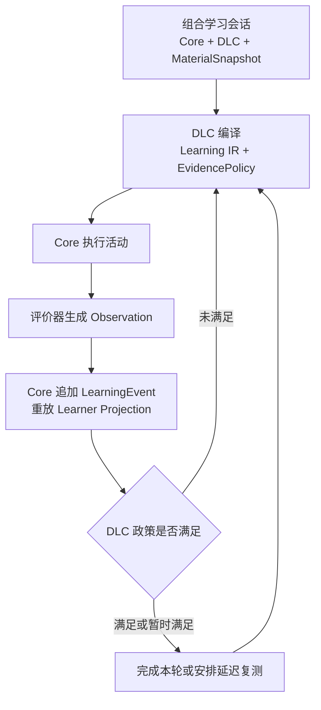

# LLOS 第一代：学习闭环与八项契约修订——TRAE 开工交接文档

> 状态：建议作为 `Contract v0.2` 的输入草案  
> 日期：2026-08-15  
> 面向：Human、TRAE、WorkBuddy 及后续协作 Agent  
> 仓库核对基线：[`b10761f181827e01a6f29ae68ff37b9787c0e804`](https://github.com/zevensommer-creator/llos/tree/b10761f181827e01a6f29ae68ff37b9787c0e804)  
> 目的：在不推翻市场、班级、支付和前端产品设计的前提下，冻结学习闭环、Core/DLC/素材层边界及八项必须修订的契约。

---

## 0. 先给出实施结论

### 0.1 可以开始编码

可以开始，但第一项任务应当是：

> **P0.5：Contract v0.2 冻结；随后实施 P1A：Core 学习事件、reducer 与政策解释器骨架。**

不应直接使用当前 `0.1.x` schema 生成全部业务代码，因为现有契约仍缺少学习事件、学习状态投影和证据政策，并存在权限、Agent 分工、活动扩展方式等矛盾。

### 0.2 市场、班级等产品功能不需要推翻

市场、班级、支付、账户和正式前端与本次修订**没有根本冲突**。绝大部分产品需求可以保留，必要改动主要是接口对齐：

| 产品模块 | 保留的产品能力 | 需要对齐的接口 | 影响程度 |
| --- | --- | --- | --- |
| 市场 | 浏览、筛选、评价、获取、下架、版本展示 | 市场分发对象应引用 DLC、素材及其兼容组合；发布前检查创作者能力 | 低 |
| 班级 | 建班、邀请、分配内容、进度统计、通知 | 班级分配引用已冻结的学习组合；统计只能读取 Core 投影 API | 低至中 |
| 支付与授权 | 免费、买断、订阅、班级授权 | entitlement 在学习会话组合前校验；不得由 DLC 直写 | 低 |
| 学习者前端 | 训练、反馈、进度、恢复会话 | 识别 `ChatSession` / `LearningSession`；展示版本化状态而非永久 `learned=true` | 中 |
| Studio | DLC/素材创建、试用、上传、发布 | 新增身份验证、MaterialSnapshot、DLC 沙箱和 schema 校验 | 中至高 |
| 班级统计前端 | 完成率、薄弱点、学习时长 | 读取投影，不直接读取事件或某个 DLC 的私有状态 | 中 |

因此可以并行开发市场和班级，但应遵守两个条件：

1. 不自行复制或发明学习状态字段；统一等待 Core Projection API。
2. 不把 DLC 与素材永久合并成一个内部对象；市场可以将二者包装成面向用户的“学习内容包”，内部仍保持两个版本化引用。

本次修订是对**学习内核和交接接口**的冻结，不是重新设计整个产品。

---

## 1. 已确认且不得被开发 Agent 擅自改变的决策

1. LLOS 有三个独立层级：**Core、DLC、素材层/素材库**。
2. 三层形成有效组合以后才能开始学习；这里的“同时工作”是会话组合不变量，不要求三个线程物理并发。
3. DLC 为空时，系统进入普通聊天模式；即使聊天引用了素材，也不能产生掌握度证据、复习计划或学习状态投影。
4. 素材既可以来自已存素材、创作者上传，也可以由 LLM 随机生成或按照用户/DLC 指令生成。
5. DLC 和素材的上传、保存为公共资产及发布，必须先取得教师或开发者身份及相应能力。
6. 学习者在运行时请求临时生成素材，不等于上传或发布；只有保存进素材库或公开分发时才需要创作者能力。
7. Core 保持语言、语言学理论和教学理论中立。德语场景、能力单元、rubric 和理论解释不进入 Core。
8. TRAE 与 WorkBuddy 是同一多 Agent 协作体系中的平等执行者；差异只来自当前任务分配，不是永久产品或系统边界。Human 是最终决策者。
9. 第一代目标是完整但受限的内部测试产品，不是 Demo 或最小网页。持续工程测试必须进行，完整产品初测在选定的第一代功能完成后进行。
10. 第一代内部测试暂不以版权工作流为阻塞项，但保留素材来源、模型生成和版本 provenance，以免未来无法追溯。

---

## 2. 学习闭环的总设计

### 2.1 总原则：固定协议，可变政策

学习闭环采用：

> **Core 固定闭环协议 + DLC 声明可版本化的 EvidencePolicy + 素材层提供具体任务实例。**

不能把整个闭环交给 DLC，否则每个 DLC 都可能发明一套不可审计的状态写入方式；也不能把具体“学会”规则写死在 Core，否则会破坏 LLOS 的理论中立性。



### 2.2 两个互相嵌套的闭环

#### 会话内微循环

```text
选择任务 → 呈现任务 → 学习者作答 → 生成证据 → 反馈 → 决定下一任务
```

它解决的是当前训练中的适应、纠错和补救。

#### 跨会话宏循环

```text
安排复测 → 时间间隔 → 新会话中的提取或迁移任务
→ 新证据 → 更新投影 → 再安排或结束
```

它解决的是保持、遗忘、迁移和证据过期。一次训练中的流畅表现只能成为即时证据，不能自动等同于长期学习。

### 2.3 会话路由与三层组合

#### ChatSession

满足以下条件时创建普通聊天会话：

```text
dlc_ref = null
```

规则：

- 可以调用 LLM、ASR、TTS，也可以引用素材作为聊天上下文；
- 可以保存普通聊天历史和运行审计；
- 不得追加 `mastery.evidence_added`、`review.scheduled` 等学习事件；
- 不得更新 LearnerStateProjection；
- 不得在 UI 中把聊天完成度显示为学习掌握度。

#### LearningSession

创建学习会话必须同时具备：

```text
Core ready
AND valid DLC reference
AND valid MaterialSnapshot
AND compatible contract versions
AND valid entitlement
AND required Provider capabilities available or an explicit fallback
```

如果 DLC 已选择但素材缺失：

1. 先依据 DLC 的 `MaterialRequest` 尝试从素材库解析；或
2. 经过 Gateway 生成临时素材并冻结为 `MaterialSnapshot`；
3. 两者均失败则拒绝启动学习，不得伪造空素材；
4. 不得静默降级成聊天，除非用户明确选择切换。

### 2.4 推荐执行顺序

1. **Route**：Core 判断创建 ChatSession 还是 LearningSession。
2. **Authorize**：校验学习授权、DLC/素材 entitlement 和 Provider 预算。
3. **Request material**：DLC 根据目标、Learner Projection 和用户指令声明 `MaterialRequest`。
4. **Resolve material**：素材层从素材库、上传资产或 LLM 生成中解析素材。
5. **Freeze snapshot**：生成不可变的 `MaterialSnapshot`。
6. **Compile**：DLC 将 MaterialSnapshot、学习者投影、目标、设备能力和预算编译为 Learning IR 与 EvidencePolicy。
7. **Validate**：Core 校验 IR、政策、版本、预算和运行原语。
8. **Execute**：Core 运行活动并收集回答。
9. **Evaluate**：评价器产生类型化 LearningObservation；证据不足时明确 `abstain`。
10. **Append**：Core 追加不可变 LearningEvent。
11. **Reduce**：确定性 reducer 重放并更新 LearnerStateProjection。
12. **Decide**：Core 使用 DLC 编译出的 EvidencePolicy 生成 MasteryDecision。
13. **Continue**：DLC 在允许的结果中选择继续、补救、变式、迁移、延迟复测或结束；Core执行硬预算和终止条件。

---

## 3. 三层在闭环中的职责

| 层级 | 必须负责 | 不得负责 |
| --- | --- | --- |
| Core | 会话模式、身份权限、授权、事件账本、schema 校验、确定性 reducer、投影、政策解释器、回放、幂等、预算、超时、安全边界 | 德语能力分类、具体语言学理论、固定 CEFR 目标、教学 rubric、全局“学会阈值” |
| DLC | LearningClaim、任务—证据映射、rubric、EvidencePolicy、阈值、提示惩罚、间隔要求、迁移要求、补救策略、下一任务政策、素材生成约束 | 直接改数据库、直接写掌握度、伪造事件、绕过 Gateway、修改历史证据 |
| 素材层 | 文本、音频、图片、场景、人物、语料、题目实例、生成素材和来源信息 | 决定学习者是否学会、持有学习状态、定义 Core 权限 |

复杂统计模型也遵守该边界：DLC 可以引用版本化估计器，估计器只能返回类型化结果；最终事件写入、投影和状态变更仍由 Core 完成。

---

## 4. “什么算学会”的建议

### 4.1 不保存永久布尔值

不建议把以下字段作为事实来源：

```json
{
  "learned": true,
  "mastery_score": 0.86
}
```

更合适的定义是：

> “学会”是某个 DLC 的某个 EvidencePolicy 版本，在指定证据窗口内，对某个 LearningClaim 作出的可重算、可解释、可撤销的判断。

建议 `MasteryDecision` 至少包含：

- `decision_id`
- `learner_id`
- `claim_ref`
- `policy_ref` 和 `policy_version`
- `status`
- `reason_codes`
- `evidence_refs`
- `evaluated_at`
- `valid_until`（可选）
- `reducer_version`
- `estimator_ref`（可选）

### 4.2 Core 通用状态

Core 可以固定以下与语言理论无关的状态：

| 状态 | 含义 |
| --- | --- |
| `insufficient` | 没有足够的有效证据作出判断 |
| `provisional` | 当前证据达到即时标准，但 DLC 声明的保持/复测条件尚未完成 |
| `satisfied` | 当前 EvidencePolicy 的全部必要条件满足 |
| `conflicted` | 有效证据之间出现超过政策容忍范围的冲突 |
| `stale` | 证据超过 DLC 声明的有效期，需要重新确认 |

DLC 可以为这些状态提供用户界面标签，但不能改变它们的事件语义。

### 4.3 参考 DLC 的实验默认政策

第一代参考 DLC 可以使用下列默认值来测试系统，但不得把它们写成 Core 常量：

1. 至少两条相互独立的成功证据；
2. 证据至少来自两个不同会话；
3. 至少一次延迟提取，例如距离首次成功不少于 24 小时；
4. 如果 LearningClaim 明确声称具有迁移能力，再要求不同素材、场景或表达形式中的迁移证据；
5. 使用答案暴露、逐词模仿或强提示的回答降低 independence，是否计入由 DLC 声明；
6. 新的有效失败证据可以使 `satisfied` 转为 `conflicted` 或 `stale`；
7. DLC 可以为即时任务完成型目标声明无需延迟验证，但用户界面不应把它包装成永久掌握。

“两次、两个会话、24 小时”只是参考实现参数，不是普遍教育学定律。

### 4.4 严格区分表现与测量置信度

必须分别保存：

- `performance_score`：学习者完成得怎么样；
- `measurement_confidence`：评价器对测量结果有多确定；
- `assistance_level`：学习者获得了多少提示或答案暴露；
- `abstention`：评价器是否因为证据不足而拒绝判定。

高置信度的低分是可靠失败；低置信度的高分不能算可靠成功。现有 IR 示例把 `pronunciation.target_confidence >= 0.8` 当作成功条件，应改为“表现门槛 + 测量置信度门槛”两个条件。

### 4.5 FSRS 与知识追踪模型的位置

- FSRS 只用于 DLC 选择的记忆保持与复习时间调度，不是全平台通用掌握度算法。
- BKT、PFA、HLR 或未来知识追踪模型可以作为版本化 estimator/projector 插件加入。
- 模型估计不是历史事实；原始 LearningEvent 才是事实来源。
- 在没有真实内部测试数据和校准结果前，不选择一个概率阈值作为普遍“学会标准”。

---

## 5. LearningObservation、LearningEvent 与投影

### 5.1 LearningObservation 建议字段

每条评价观察至少应记录：

- `observation_id`
- `learner_id`
- `session_id`
- `activity_id`
- `claim_id`
- `material_snapshot_id`
- `evidence_group_id`
- `response_ref`
- `performance`
- `measurement_confidence`
- `assistance_level`
- `context_features`
- `evaluator_ref`、模型/规则版本
- `abstention` 和原因
- `observed_at`
- `provenance`

### 5.2 LearningEvent 原则

- 由 Core 校验后追加；DLC、Agent、Provider 都不能直接写入事件库。
- 使用 `event_id` 和幂等键防止重试产生重复证据。
- 历史事件不可被 DLC 升级或政策升级重写。
- 投影可以删除并从事件流重建。
- 同一事件流、相同 reducer 与政策版本必须得到相同投影。
- 政策升级产生新决策版本，不篡改旧版本结论。

### 5.3 多 Claim 与独立证据

同一段口语可能同时支持发音、语法、词汇或任务完成等多个 Claim。允许一条回答产生多条 Observation，但必须：

1. 每条 Observation 明确指向一个 `claim_id`；
2. 共享同一个 `evidence_group_id`；
3. DLC 显式声明从任务表现到 Claim 的归因规则；
4. Core 在计算最小独立证据数量时按 `evidence_group_id` 去重；
5. 同一素材的简单改写、同一次重试和同一答案暴露后的回答不得自动被视为相互独立。

---

## 6. LLM 素材生成的正式边界

### 6.1 MaterialSource

建议至少支持：

```text
stored
uploaded
generated_random
generated_instructed
derived
```

### 6.2 MaterialRequest

由 DLC 根据学习目标和投影声明需求，例如：

- 所需语言、体裁、场景和模态；
- 允许或禁止出现的结构；
- 长度、难度和主题约束；
- 需要覆盖的 Claim；
- 随机性要求；
- 安全约束；
- 是否允许从既有素材变式生成；
- 是否允许保存或只能临时使用。

### 6.3 MaterialSnapshot

无论素材来源如何，进入编译器前必须冻结为不可变快照，并记录：

- 来源类型和来源引用；
- 用户指令和 DLC 生成约束；
- 随机种子；
- Provider、模型和模型版本；
- 生成参数；
- 内容哈希；
- schema 校验结果；
- 安全/质量校验结果；
- 创建时间；
- `ephemeral`、`private_saved` 或 `published` 生命周期状态。

运行时生成临时素材可以由普通学习者触发；将其保存为素材资产、上传新素材或公开发布时，必须经过创作者能力检查。

---

## 7. 八项必须修订的问题

### 问题一：缺少完整学习状态契约

#### 当前问题

架构文档提到了追加式事件和投影，但仓库没有独立的 LearningEvent、LearnerStateProjection 和 EvidencePolicy schema。当前 P1 若直接“schema 生成代码”，会生成一个没有真正学习闭环的 Core。

#### 决策

新增或正式定义：

- `learning-claim.schema.json`
- `evidence-policy.schema.json`
- `learning-observation.schema.json`
- `learning-event.schema.json`
- `learner-state-projection.schema.json`
- `mastery-decision.schema.json`
- `session-composition.schema.json`

同时明确 ChatSession 与 LearningSession；DLC 为空时不得建立学习投影。

#### 验收

- 同一事件流可确定性重放；
- DLC=null 测试不会写入学习状态；
- 政策版本变化不会修改历史事件；
- `performance_score` 与 `measurement_confidence` 在 schema 中类型和含义分离。

---

### 问题二：素材生成和快照边界不完整

#### 当前问题

现有 Material Pack 主要描述版本化素材包，但没有完整表达 LLM 随机生成、按指令生成、临时使用、保存和发布之间的边界。

#### 决策

新增：

- `MaterialRequest`
- `MaterialSource`
- `MaterialSnapshot`
- 生命周期：`ephemeral | private_saved | published | withdrawn`

所有生成素材先冻结快照，再进入 DLC 编译。生成失败时暂停或拒绝学习会话，不得让 LLM 输出自动成为课程事实。

#### 验收

- 生成素材具有提示、种子、模型版本和哈希；
- 相同快照在同一 DLC/状态/种子下可重现相同编译输入；
- 普通学习者可请求临时生成，但无权保存或发布；
- 生成输出 schema 不合法时不能进入 Learning IR。

---

### 问题三：任意训练模式与固定 ActivityKind 冲突

#### 当前问题

产品规格允许 DLC 定义任意训练模式，现有 Learning IR 却把 `ActivityKind` 固定为有限教学活动枚举。如果直接扩充枚举，Core 将不断吸收具体教学理论；如果允许任意字符串或 JSON，Core 又无法安全执行。

#### 决策

DLC 可以定义任意**高层教学模式**，但必须编译成封闭、版本化的**低层运行原语**。建议第一代原语包含：

- `present`
- `capture_text`
- `capture_audio`
- `capture_choice`
- `invoke_capability`
- `evaluate`
- `branch`
- `feedback`
- `emit_observation`
- `schedule`
- `checkpoint`
- `stop`

高层的 shadowing、翻译、构式训练、角色对话等属于 DLC，不属于 Core 枚举。需要新运行能力时，升级 IR/primitive 版本并走 ADR。

#### 验收

- 参考 DLC 的不同训练模式都能降低为原语；
- Core 遇到未知原语时拒绝执行；
- IR 中不保留无 schema 的任意 JSON；
- 新 DLC 不需要把德语、CEFR 或某个教学流派写入 Core。

---

### 问题四：证据独立性与多目标归因缺失

#### 当前问题

如果只记录“答对三次”，同一次回答的重复评分、同一素材的机械变体或同一次提示后的重试可能被错误累计；一条回答同时支持多个能力时也没有明确的 credit assignment。

#### 决策

引入：

- `evidence_group_id`
- `claim_id`
- `task_variant_id`
- `assistance_level`
- `independence_tags`
- DLC 声明的 evidence mapping

Core 负责幂等、分组和去重；DLC 决定哪些证据类型对某个 Claim 有效，但不能伪造独立性。

#### 验收

- 重复提交同一事件不会增加证据数；
- 同一回答产生多 Claim Observation 时共享证据组；
- 同一答案暴露后的立即重试默认不算独立证据；
- 不同 DLC 可对相同事实事件应用不同政策，同时保留完整解释路径。

---

### 问题五：创作者权限契约与已确认需求相反

#### 当前问题

当前 `product_spec.md` 写着注册即获得 `publish_dlc`，并允许零审核发布。这与“DLC 和素材上传必须先取得教师或开发者身份”的已确认决策冲突。

#### 决策

继续采用能力点，而不是互斥角色层级。建议能力至少拆分为：

- `learn`
- `generate_material_ephemeral`
- `create_dlc_draft`
- `upload_dlc`
- `upload_material`
- `test_dlc_sandbox`
- `publish_dlc`
- `publish_material`
- `create_class`
- `review_content`
- `manage_users`

创作者验证状态可以是：

```text
unverified
teacher_verified
developer_verified
suspended
```

教师和开发者验证均可授予上传/发布能力；具体能力仍可单独撤销。平台管理员能力与“DLC 开发者身份”不得混为一谈。

#### 验收

- 新注册用户只能学习、聊天和请求临时素材；
- 未验证用户上传/发布 DLC 或素材返回明确拒绝；
- 已验证教师和开发者走同一能力校验接口；
- 权限撤销后不能新发布，但历史归属和事件不被删除。

---

### 问题六：TRAE 与 WorkBuddy 被错误固化为产品分工

#### 当前问题

当前 `AGENTS.md` 把 Core、市场、前端、测试等目录永久分配给不同 Agent，容易被误解为两个 Agent 在架构上具有不同等级或固定职责。

#### 决策

- TRAE、WorkBuddy 和未来 Agent 都属于同一协作池；
- 每个 Agent 可承担任意模块任务；
- 文件锁和临时 owner 只在具体任务生命周期内有效；
- 不允许两个 Agent 同时修改同一文件；
- 跨边界契约变更需要 ADR、schema 版本升级和 Human 批准；
- Human 对架构、范围和冲突拥有最终决定权。

如果正式名称是 `WorkBuddy`，全仓统一该拼写；如果 Human 决定使用 `WalkBuddy`，则一次性全仓改名，不应混用。

#### 验收

- `AGENTS.md` 不再有永久目录所有权；
- TASKS/lock 文件仍能表达本次任务负责人；
- 任何 Agent 都必须遵守相同 schema、测试和审计要求；
- Agent 无权自行改变 Core/DLC/素材三层边界。

---

### 问题七：DLC 编译代码缺少隔离和失败语义

#### 当前问题

DLC 被定义为编译器，但目前没有完全冻结其执行权限、网络/文件访问、资源预算、超时、崩溃和恶意输出处理。如果 DLC 可以任意执行宿主代码，就可能绕过 Core 特权边界。

#### 决策

- DLC 在隔离进程、容器或等价沙箱中运行；
- 只能接收 schema 校验后的输入；
- 只能返回 Learning IR、EvidencePolicy、MaterialRequest 和诊断；
- 无直接数据库、学习事件库、支付、身份或任意网络访问；
- Provider 调用只能提交给 Gateway；
- 固定 CPU、内存、时间、调用次数和费用预算；
- 记录 DLC 包哈希、版本、编译参数和随机种子；
- 超时、崩溃、非法 IR 和能力缺失必须有类型化错误及显式 fallback；
- Core 设置最大循环次数、最大会话时间和硬停止条件，DLC 不能制造无限补救循环。

#### 验收

- DLC 尝试写学习状态时被拒绝；
- DLC 尝试直接联网或访问未授权文件时被拒绝；
- 超时和预算耗尽不会留下半写状态；
- 非法编译结果不能进入执行器；
- 降级路径和失败原因进入审计事件。

---

### 问题八：完整第一代产品缺少统一验收定义

#### 当前问题

仓库已有产品规格和分步计划，并非没有产品需求；问题在于核心用户旅程、错误恢复和“完整第一代何时完成”尚未统一成可执行验收矩阵。若各模块各自判断完成，最终可能只有功能清单，没有完整产品闭环。

#### 决策

至少冻结四条产品旅程：

1. **普通聊天者**：注册/进入 → DLC 为空 → 文本或语音聊天 → 不产生学习状态。
2. **学习者**：获取组合 → 启动学习 → 完成活动 → 查看反馈和状态 → 中断恢复 → 延迟复测。
3. **教师**：验证身份 → 建班 → 分配组合 → 查看班级投影 → 不接触学习者原始敏感数据。
4. **DLC/素材创作者**：验证身份 → 创建/上传 → 沙箱试用 → schema/质量门 → 发布 → 版本升级/下架。

还要覆盖：

- Provider 不可用、超时和弃权；
- 会话断线和幂等恢复；
- 组合版本升级；
- DLC 或素材被下架；
- 学习者导出/删除数据；
- 音频默认处理后不留存，留存需明确同意；
- 市场、班级、学习状态与 entitlement 的端到端一致性；
- 内部测试进入条件和退出条件。

#### 验收

- 每条旅程有 E2E 测试；
- 每个失败分支有用户可理解状态，不依赖后台日志；
- 所有模块共享同一术语和版本引用；
- 第一代选定范围内没有用 Demo、占位页面或人工改数据库代替正式流程。

---

## 8. 对现有仓库文件的具体修改建议

### `docs/LANGUAGE_PLATFORM_SPEC.md`

- 升级至 `0.2.0`；
- 增加 ChatSession/LearningSession；
- 加入完整学习闭环、EvidencePolicy 和 MaterialSnapshot；
- 明确“学会”是版本化政策判断，不是不可变事实；
- 明确 FSRS 只属于可选记忆调度；
- 增加 DLC 沙箱与失败语义。

### `docs/product_spec.md`

- 删除注册即获得 `publish_dlc`；
- 增加创作者验证和细粒度上传/发布能力；
- 加入普通聊天、运行时临时素材生成和完整四类用户旅程；
- 保留市场、班级、支付和 Studio 现有产品功能。

### `docs/BUILD_PLAN.md`

- 在现有 P1 前插入 P0.5 契约冻结；
- 把 FSRS 从全局学习调度改为参考 DLC 可选记忆调度；
- P1 增加 LearningEvent、Projection、EvidencePolicy 和 SessionComposition；
- 市场/班级主线可在契约冻结后与 Core 并行；
- 完整产品初测以前完成四条用户旅程的 E2E。

### `AGENTS.md`

- 删除 TRAE/WorkBuddy 永久模块所有权；
- 改为任务级 owner 和文件锁；
- Human 为最终决策者；
- 统一 Agent 名称拼写；
- 更新规范版本引用。

### `docs/contracts/learning-ir.schema.json`

- 高层 ActivityKind 改为 DLC 层概念；
- Executable IR 使用封闭运行原语；
- 移除任意 JSON `value`、任意事件字符串及无 schema extensions；
- 修复把 measurement confidence 当作表现成功条件的问题；
- 固定 Core event registry 或 schema 引用。

### `docs/contracts/material-pack.schema.json`

- CEFR 等级、register 分类等改为 DLC/扩展 profile 可声明字段，而非理论中立 Core 的普遍必填真理；
- 增加 MaterialSource、MaterialRequest、MaterialSnapshot 和生成生命周期；
- 对扩展字段要求显式 schema ID 和版本。

### 新增契约与测试目录

- 为新增 schema 生成类型和 validator；
- 每份 schema 提供正例、反例和边界 fixtures；
- 建立 deterministic replay、idempotency、policy versioning、权限和沙箱契约测试。

---

## 9. 建议实施顺序

### 阶段 A：P0.5 契约冻结

1. 提交 gap report；
2. 编写 ADR；
3. 修订统一事实来源；
4. 新增/升级 schema；
5. 添加 schema fixtures；
6. Human 审核术语、边界和迁移说明。

### 阶段 B：P1A Core 骨架

1. schema → 类型和 validator；
2. 追加式 LearningEvent store；
3. 确定性 reducer；
4. LearnerStateProjection；
5. EvidencePolicy 解释器；
6. ChatSession/LearningSession 路由；
7. Fake DLC、Fake Material Resolver、Fake Evaluator；
8. CLI 跑通学习闭环。

### 阶段 C：产品线并行

契约冻结后，以下可以并行：

- 账户与能力点；
- 市场浏览、评价和 entitlement；
- 班级 CRUD、邀请和通知；
- 前端通用壳与 session-mode 路由；
- Studio 身份验证和草稿流程。

依赖 Learner Projection 的统计页面先使用 Mock Projection API，不得自己创造掌握度字段。

### 阶段 D：参考组合验证

使用一个参考 DLC、一个静态素材快照和一个 LLM 生成素材快照验证：

```text
Core + Reference DLC + Static MaterialSnapshot
Core + Reference DLC + Generated MaterialSnapshot
Core + DLC null + Chat context
```

参考德语内容只是测试组合，不是 Core 的语义来源。

---

## 10. 必须通过的最低测试矩阵

1. `dlc_ref=null` 时创建 ChatSession，不写学习投影。
2. LearningSession 缺少 DLC、MaterialSnapshot 或 entitlement 时无法启动。
3. 运行时生成素材记录指令、随机种子、模型版本和哈希。
4. 未通过 schema/质量校验的生成素材不能进入 DLC。
5. 同一幂等键重复提交只生成一个有效 LearningEvent。
6. 重复 `evidence_group_id` 不增加独立证据计数。
7. 同一回答可以映射多个 Claim，但具有明确归因并共享证据组。
8. `performance_score` 与 `measurement_confidence` 不能互换。
9. 低测量置信度触发 abstain，不写入可靠成功/失败证据。
10. 同一事件流重放产生完全相同投影。
11. EvidencePolicy 升级生成新决策，不改写历史决策。
12. DLC 直接写状态、直接调用网络或使用未知原语时被拒绝。
13. DLC 超时、崩溃或预算耗尽后，事件库保持一致。
14. 普通用户可以请求临时素材，但不能上传、保存为公共资产或发布。
15. 已验证教师与开发者可按能力上传/发布，能力撤销立即生效。
16. 市场 entitlement、班级分配和 LearningSession 组合校验一致。
17. 教师只能读取班级统计投影，不能读取未授权的原始音频或私有事件。
18. 会话中断后可从 checkpoint 幂等恢复。
19. Core 达到硬循环、时长或费用上限时能够安全停止。
20. 第一代四类用户旅程均有 E2E 测试。

---

## 11. 可直接交给 TRAE 的执行指令

```text
执行 LLOS P0.5「学习闭环与 Contract v0.2 冻结」，随后实现 P1A Core 学习状态骨架。

先完整阅读：
- AGENTS.md
- docs/LANGUAGE_PLATFORM_SPEC.md
- docs/product_spec.md
- docs/BUILD_PLAN.md
- docs/contracts/*.schema.json
- 本文档

不可改变的决策：
1. Core、DLC、素材层是三个独立层级；有效三层组合以后才能创建 LearningSession。
2. DLC 为空时创建 ChatSession；即使引用素材，也不产生掌握度、复习计划或 LearnerStateProjection。
3. 素材可以来自库内、上传、LLM 随机生成或受指令生成；学习执行前必须冻结为可追溯 MaterialSnapshot。
4. Core 固定事件、reducer、投影和政策解释协议；DLC 声明 LearningClaim、rubric、EvidencePolicy、阈值、间隔、迁移与补救策略。
5. performance_score、measurement_confidence、assistance_level 和 abstention 必须分离。
6. FSRS 只用于 DLC 选择的记忆调度，不是全局掌握度模型。
7. DLC 和素材的上传、保存和发布只授予已验证教师或开发者；普通用户仍可请求临时生成素材。
8. DLC 高层训练模式必须降低为封闭的 Core 运行原语，不允许任意 JSON 或未知可执行类型。
9. DLC 只能在隔离环境中通过类型化输入输出工作，不得直接写数据库、学习状态、支付、身份或绕过 Gateway。
10. TRAE 与 WorkBuddy 是平等协作 Agent，只允许任务级 owner/lock；Human 最终裁决。
11. 市场、班级、支付和正式前端现有产品目标保留；本次只对齐其权限、组合、投影和 entitlement 接口。
12. 第一代是完整但受限的内部测试产品，不以 Demo 或最小网页作为最终验收；版权工作流暂不阻塞，但保留 provenance。

必须交付：
A. 当前契约 gap report。
B. 学习闭环、会话模式、EvidencePolicy、MaterialSnapshot、DLC 沙箱、Agent 协作的 ADR。
C. 新增或修订 LearningClaim、EvidencePolicy、LearningObservation、LearningEvent、LearnerStateProjection、MasteryDecision、SessionComposition、MaterialRequest、MaterialSnapshot schema。
D. 修订现有 Learning IR、Material Pack、DLC Manifest、product_spec、BUILD_PLAN 和 AGENTS.md，升级版本引用并消除矛盾。
E. 每份 schema 的正例、反例和边界 fixtures。
F. Core 追加事件存储、确定性 reducer、投影、政策解释器和 Chat/Learning session router 的最小可运行代码。
G. Fake DLC、Fake Material Resolver、Fake Evaluator 和 CLI 闭环。
H. 本文第 10 节测试矩阵的自动化测试。

实施纪律：
- 不把德语能力、CEFR、具体语言学理论或参考 DLC 参数写进 Core。
- 不由市场、班级或前端自行定义学习状态。
- 不允许 Agent 或 DLC 直接修改历史事件或派生状态。
- 发现本文与仓库既有 ACCEPTED 基线冲突时，先形成 ADR 和明确 diff；不得静默选择旧规则。
- 合同和测试通过后才能扩大正式业务实现。

完成后向 Human 提交：变更清单、ADR、schema diff、迁移说明、测试输出、仍待决事项和下一阶段文件级实施计划。
```

---

## 12. 学术设计依据

本设计不主张一种理论可以定义所有语言学习，而是采用“主张—证据—任务—版本化判断”的通用容器：

1. 训练时表现不一定代表长期学习，长期保持与迁移需要区别对待：  
   [Soderstrom & Bjork (2015), Learning versus performance](https://pubmed.ncbi.nlm.nih.gov/25910388/)
2. 提取练习对长期保持的重要性：  
   [Karpicke & Roediger (2008), The critical importance of retrieval for learning](https://pubmed.ncbi.nlm.nih.gov/18276894/)
3. 分散练习/间隔效应的综述与元分析：  
   [Cepeda et al. (2006), Distributed practice in verbal recall tasks](https://pubmed.ncbi.nlm.nih.gov/16719566/)
4. 提取练习对迁移的研究：  
   [Butler (2010), Repeated testing produces superior transfer of learning](https://pubmed.ncbi.nlm.nih.gov/20804289/)
5. 主张、证据模型与任务模型的系统化设计框架：  
   [Mislevy & Riconscente (2005), Evidence-Centered Assessment Design](https://padi.sri.com/downloads/TR9_ECD.pdf)
6. 可作为未来 DLC 估计器的经典知识追踪模型：  
   [Corbett & Anderson, Knowledge tracing](https://link.springer.com/article/10.1007/BF01099821)
7. 仅用于记忆保持调度的 FSRS/DSR 模型：  
   [Free Spaced Repetition Scheduler](https://github.com/open-spaced-repetition/free-spaced-repetition-scheduler)

这些研究支持参考政策中的保持、提取、间隔和迁移设计，但不支持把某个固定次数、24 小时或统一概率阈值写成所有 DLC 的普遍真理。具体政策应随 DLC、Claim 类型和内部测试数据持续版本化。

---

## 13. 最终开工判断

- **允许立即开始**：P0.5 契约、schema、测试和 P1A Core 骨架。
- **允许契约冻结后并行**：账户、市场、班级、支付框架、前端通用壳和 Studio 草稿流程。
- **暂不允许**：各模块绕过 Projection API 自建掌握度；按当前错误权限直接开放发布；让 DLC 执行未知代码或直写状态；把参考德语理论固化进 Core。
- **不阻塞开工**：最终采用 BKT、PFA、FSRS 或其他学术模型的选择；具体德语能力单元；不同 DLC 的阈值；第一代内部测试中的版权工作流。

只要先冻结上述接口，后续学习理论和素材策略即使变化，市场、班级及大部分产品功能也不需要重写。
