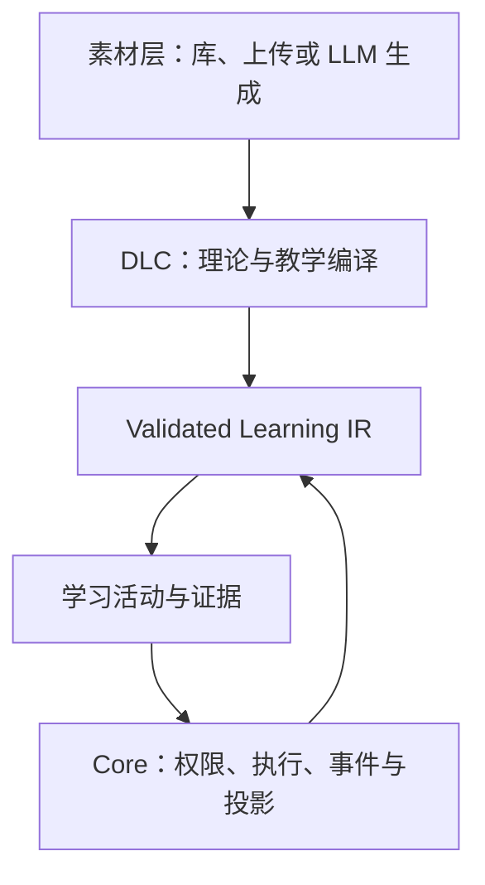

# LLOS 第一代设计修订指令与“学会”状态闭环草案

> 目标仓库：[`zevensommer-creator/llos`](https://github.com/zevensommer-creator/llos)  
> 审阅基线：commit [`b10761f181827e01a6f29ae68ff37b9787c0e804`](https://github.com/zevensommer-creator/llos/commit/b10761f181827e01a6f29ae68ff37b9787c0e804)，2026-08-15  
> 文档性质：交给 TRAE、WorkBuddy/WalkBuddy 及其他编码 Agent 的规范性修改指令  
> 决策者：Human；Agent 负责实现、验证和报告，不得自行改写产品边界  
> 状态：设计草案。Human 将本文件交给编码 Agent 后，其中“必须/不得”条款视为本轮明确输入；学术阈值部分仍是待内测校准的工程假设。

---

## 0. 执行摘要

本轮不要继续制作 Demo、MVP 或一次性的最小网页。Demo 已跑通。第一代的目标是完成一个**边界受限、仅供内部使用、但在其范围内功能完整的成品**，全部纳入第一代范围的功能完成后，再开始初步内部产品测试。

本轮需要同时完成四类修订：

1. 将 LLOS 固定为 **Core、DLC、素材层三层协作系统**。学习模式只有在三层同时就绪时才能启动；DLC 为 `null` 时进入普通聊天模式，不得产生“已学会”状态。
2. 修正文档中的身份和权限错误：DLC 与素材的上传、入库、发布都只允许已验证的教师或开发者身份进行。
3. 清除现有规范和 schema 内部的矛盾，包括任意 JSON、任意事件名、固定理论类别、把置信度当成绩、自定义训练模式与闭合集合冲突、缺少学习事件和学习状态契约等。
4. 建立一个理论中立、可重放、可版本化的学习状态闭环。Core 只处理证据、投影和确定性策略；具体能力、德语场景、语言学理论、评分含义与“何时算学会”的政策由 DLC 和素材层声明，不写死在 Core。

本轮推荐做破坏性契约升级：架构基线升为 `0.2.0`，相关 JSON Schema 升为 `0.2.0`。不要用补丁版本掩盖语义破坏性变化。

### 0.1 当前仓库基线

本文件审阅的公开 commit 以规范、研究文档和六份 schema 为主，核心模块目录尚未包含可审阅的业务实现。若 TRAE 本地工作区有尚未推送的更新或 Demo 代码，执行前先提交一份 gap report：列出本地 HEAD、未提交改动、与上述 commit 的差异，以及哪些条款已在其他代码库实现。不要覆盖用户现有改动，也不要因为本地实现存在就跳过契约对齐。

---

## 1. Human 已确认的产品边界

以下内容不是待讨论项，必须同步到 `README.md`、`AGENTS.md`、`docs/product_spec.md`、`docs/BUILD_PLAN.md` 和相关 ADR。

### 1.1 第一代是什么

- 第一代是**受限的内部原型成品**，不是公开商用版本。
- “原型”描述的是使用范围和风险边界，不代表只做局部功能或临时界面。
- “完整”表示所有被明确列入第一代的功能、最终使用界面、契约、状态闭环和验收用例都已完成，而不是只跑通一条 happy path。
- 不新增“最小网页验证”里程碑，不制作最终会被丢弃的最小页面。现有 Demo 已经完成可行性验证；第一代应实现计划中的正式界面。
- **产品级初步内测**在完整第一代通过完成定义后开始。
- 单元测试、契约测试、回放测试、Golden test、安全测试和自动化 E2E 必须随开发持续执行；这些是工程验证，不等于提前进行产品内测。

### 1.2 第一代暂缓的内容

- 第一代仅内部使用，暂不让版权审查、投诉下架、公开市场法律流程阻塞开发。
- 现有来源、哈希和生成记录仍应保留，因为它们服务于复现、调试和审计，不仅服务于版权。
- `license` 在 `distribution_scope = internal` 时不得成为 schema 校验或学习启动的硬门槛；对未来公开分发可以重新设为必填。
- 不删除未来公开分发所需的接口位置，但本轮不实现版权预审、侵权投诉、法律处置和相关运营后台。
- ADR-009 不应被抹除。将其适用范围改为“未来公开分发阶段”，并新增一条 ADR 说明内部第一代暂不实现该流程。
- 除版权范围外，不得擅自推断其他已确认功能也被取消。支付、市场或其他模块如需改范围，必须由 Human 另行裁定。

### 1.3 不属于 Core 内建能力的内容

- 能力单元、德语场景和具体语言知识结构由整体设计思想、DLC 与素材层表达，不得硬编码到 Core。
- 长篇写作与论证结构、自发口语与对话管理主要由素材层提供任务、文本、情境、角色、对话回合和生成素材。
- 文本概括、解释、跨语言中介和社会语言能力主要由 DLC 承载的语言学/教学理论、rubric、编译 Pass 和证据政策进行教学化与评价。
- Core 不直接“实现”上述能力。Core 只负责身份、会话、编排、校验、执行通用 IR、追加事件、确定性投影、权限、安全与审计。
- CEFR、ACTFL、配价语法、构式语法、技能习得阶段等都可以由 DLC 或素材描述，但不得成为 Core 的不可替换真理。

---

## 2. 三层架构：Core、DLC、素材层

### 2.1 唯一正确的组合关系



Learning IR 是三层之间的稳定 ABI，不是第四个产品层。Provider Gateway 是基础设施，也不是第四个教学层。

| 层 | 负责 | 不得负责 |
|---|---|---|
| Core | 身份与权限、会话模式、三层就绪检查、IR 校验与执行、Provider 路由、追加式事件、状态投影、预算、安全、审计 | 具体语言理论、德语能力树、场景含义、教学顺序的学术解释、直接宣称某种语言能力已掌握 |
| DLC | 读取素材和已授权的学习者投影；声明 claim、理论、rubric、证据政策、教学 Pass；编译为通用 IR | 持有素材、直写用户状态、绕过 Gateway、创建 Core 未注册的事件类型或运行时特权 |
| 素材层 | 静态素材库、教师/开发者上传素材、LLM 随机生成素材、LLM 按指令生成素材、任务情境、文本/音频/角色/对话回合及其快照 | 教学策略、掌握度写入、账户权限、直接执行任意代码 |

### 2.2 会话模式必须显式建模

新增 `SessionMode`，至少包含：

```text
chat
learning
```

使用 `null` 表示没有 DLC，禁止用空对象 `{}`、空字符串或缺失字段表达多个不同含义。

#### Chat 模式

- `mode = chat`
- `dlc_ref = null`
- 可以调用普通对话 Provider，也可以附加普通上下文。
- 不生成 Learning IR。
- 不产生 `learning.evidence_recorded`、`mastery.*` 或复习调度事件。
- 不更新 Learner State Projection。
- UI 不显示“学习中”“掌握度”“已学会”等暗示。

#### Learning 模式

- `mode = learning`
- Core 已就绪。
- 存在一个非空、版本确定、校验通过、当前用户有权使用的 `dlc_ref`。
- 存在一个可解析的素材源，并且当前活动已有校验通过、带版本/哈希的 `material_snapshot_ref`。
- DLC 与 Material Snapshot 已成功编译为兼容版本的 Learning IR。
- 只有满足以上条件，Core 才能发出 `learning.session_started`。

规范化就绪条件：

```text
learning_ready =
  core_ready
  AND active_dlc_valid
  AND material_snapshot_valid
  AND compiled_ir_valid
  AND entitlement_valid
```

若 DLC 缺失，明确转入 `chat`，而不是悄悄使用一个隐含教学法。若 DLC 存在但素材无法解析，则学习会话不得启动，返回类型化错误 `MATERIAL_UNAVAILABLE`；若允许动态生成，可先尝试生成、校验和快照化，再重新执行就绪检查。

### 2.3 LLM 生成素材仍属于素材层

Material Source 至少支持以下来源：

```text
curated
uploaded
llm_random
llm_instructed
```

- `llm_random`：由素材策略给定约束与随机种子，生成符合要求的素材。
- `llm_instructed`：由教师、开发者、学习者或 DLC 提供有界意图，经 Gateway 请求素材生成。
- LLM 是 Provider；它的输出在通过 Material schema 校验、获得 ID、版本、哈希和 provenance 后，才成为素材。
- 任何呈现给学习者并将用于学习证据的动态文本、题目或对话回合，都必须先形成不可变 Material Snapshot。实时对话可以“生成—快照—编译—执行”流式交替，但不得绕过素材层直接把模型输出当作学习事实。
- 记录 `provider_id`、模型/服务版本、生成模板版本、约束、随机种子、时间、输入哈希和输出哈希。敏感原始提示可只存受控 artifact 引用。
- 学习者在已授权的学习会话中请求**临时生成**，不等同于向共享素材库上传或发布。临时素材默认仅会话可见。
- 将临时生成素材提升为共享、可发现或可复用 Material Pack，仍必须由已验证教师或开发者执行，并经过技术校验。

---

## 3. 内容、理论与平台代码的边界

### 3.1 具体能力不能成为 Core 枚举

现有 `learning-ir.schema.json` 将 `LearningObjective.domain` 固定为 communicative、lexical、construction、valency 等，并在 `PedagogicalProgram.targets` 中固定 constructions、valency、morphology、phonology、pragmatics。这把特定语言学本体写入了跨理论 ABI，应删除或迁移。

改为：

- Core 只识别 `claim_ref`、`claim_schema_ref`、`evidence_policy_ref` 和版本/哈希。
- `claim_ref` 是 DLC 命名空间内的 opaque ID；Core 不解释其语言学含义。
- DLC 可以提供可选的 `claim_descriptor` 供 UI 展示，但它属于数据 artifact，不属于 Core 源码枚举。
- 德语示例、CEFR 等级和具体场景只能出现在参考 DLC、参考 Material Pack、测试夹具或展示元数据中。
- `material-pack.schema.json` 中强制的 CEFR `target_levels` 应改为可选的通用 `level_refs`：每项携带 `scale_ref`、`level_ref` 和版本。不得假设所有 DLC 都使用 A1–C2。

### 3.2 高阶语言活动的归属

| 活动或能力 | 主要承载层 | Core 的角色 |
|---|---|---|
| 长篇写作、论证材料与题目 | 素材层 | 呈现、接收响应、调用 DLC 指定的 evaluator、记录证据 |
| 自发口语、对话场景、角色与回合 | 素材层，可由 LLM 动态生成 | 管理音频/文本会话、预算、超时、事件与 Provider |
| 文本概括与解释 | DLC 的理论、rubric 与编译 Pass | 执行 IR，不解释“好的概括”是什么 |
| 跨语言中介 | DLC 的理论与证据政策 | 记录输入、输出与结构化评价证据 |
| 社会语言能力 | DLC 的语域/语用理论与 rubric；素材提供情境 | 不内建固定社会语言学分类 |

“主要由素材层提供”不表示没有 DLC。只要系统声称这是学习活动，仍必须有一个有效 DLC 把素材转换成活动、rubric 和证据政策。DLC 为 `null` 时只能算聊天或内容消费，不能进入学习闭环。

### 3.3 自定义训练模式与闭合运行时原语

保留“DLC 可定义任意高层训练模式”，但明确其技术含义：

- DLC 可自由命名、组合和解释高层训练模式。
- 所有高层模式必须编译成版本化、闭合、受 Core 支持的 Executable IR 原语。
- DLC 不得在运行时注入一个 Core 不认识的 `activity_kind` 并要求 Core猜测执行。
- 如果确实需要新的运行时原语，必须新增 ADR、升级 IR 主/次版本、实现 Core executor 和兼容性测试。

这样既保留教学创造力，也不破坏 ABI 和安全边界。

---

## 4. 身份、上传与发布权限

### 4.1 修正现有错误

`docs/product_spec.md` 当前把 `publish_dlc` 写成“注册即获得”，并写明普通注册用户可直接上传、测试、发布。这与 Human 的要求冲突，必须修改。

采用“身份声明 + 能力点”而非不可组合的等级树：

```text
identity_claims:
  learner
  teacher
  developer

identity_status:
  pending
  verified
  suspended
  revoked
```

教师和开发者不是高低等级，但两者都是创作者能力的合格身份。身份与能力均由 Core 校验。

### 4.2 建议能力点

| 能力 | 默认获得者 | 说明 |
|---|---|---|
| `learn` | 注册用户 | 使用已授权的三层组合进行学习 |
| `join_class` | 注册用户 | 加入班级 |
| `request_ephemeral_material` | 注册用户，可受 DLC/预算限制 | 在个人学习会话中请求临时 LLM 素材；不能发布 |
| `create_class` / `manage_class` | `teacher:verified` | 教师班级能力，与内容创作能力分离 |
| `upload_material` | `teacher:verified OR developer:verified` | 上传或导入素材到个人创作区 |
| `publish_material_pack` | `teacher:verified OR developer:verified` | 将校验通过的素材发布到共享库 |
| `create_dlc_draft` | `teacher:verified OR developer:verified` | 新建或导入 DLC 草稿 |
| `upload_dlc_source` | `teacher:verified OR developer:verified` | 上传 DLC 源文件/manifest |
| `publish_dlc` | `teacher:verified OR developer:verified` | 发布通过 schema、兼容性与沙箱测试的 DLC |
| `review_content` | 平台授权 | 管理公开阶段的违规或质量问题；内部第一代可不实现运营流程 |
| `manage_users` / `system_config` / `global_stats` | 平台授权 | 平台管理能力，不由“开发者身份”自动推导 |

关键规则：

- UI 隐藏按钮不是权限控制；每个命令必须在 Core 再次授权。
- `pending`、`suspended`、`revoked` 均不得上传、入库或发布。
- “无需内容预审”不等于“无需身份、schema、安全、兼容性与沙箱校验”。
- DLC 与 Material Pack 必须有独立的草稿、上传、校验、试用、发布状态，不能用单个 `publish_dlc` 混合所有动作。
- 已发布内容的授权与用户身份撤销应分开建模；撤销创作者权限不得篡改历史 artifact。

---

## 5. 多 Agent 协作修订

### 5.1 TRAE 与 WorkBuddy/WalkBuddy 是同一协作层级

本文沿用仓库现有拼写 `WorkBuddy`。Human 最新消息中的 `WalkBuddy` 默认视为同一 Agent 的拼写变体；若 Human 确认要改名，再进行全仓一次性统一替换，不得同时保留两个身份。

- TRAE 与 WorkBuddy 都是多 Agent 协作池中的对等编码 Agent。
- 两者没有固定的“系统核心 Agent”和“产品层 Agent”区别，也没有按名字确定的文件所有权。
- 任务根据当前能力、可用性、任务认领和锁动态分配。
- 历史 `TASKS.md` 中的负责人只表示谁做过某项任务，不构成永久职责。
- Human 是最终架构和产品决策者；Human 不与编码 Agent 处于同一权限层。

### 5.2 修改协作协议

删除 `AGENTS.md` 中按 TRAE/WorkBuddy 固定划分 `core/`、`frontend/`、`tests/` 等目录的表。替换为：

- 受保护文件：`AGENTS.md`、架构基线、ADR 和 schema 需要 Human 批准或明确任务授权。
- 普通文件：由当前有效任务锁的 Agent 临时拥有。
- 生成文件：只能由对应 schema/生成器任务修改。
- 同一文件不能由两个 Agent 同时持锁。
- 分支命名改为 `feature/<agent-id>/<task-id>-<slug>`，不得为两个品牌写死专用分支规则。
- 冲突先由当前任务持锁者处理；涉及架构语义时由 Human 裁决。
- 任务对象使用通用 `agent_id`，示例不得把默认 owner 固定为 TRAE。

同步修改：

- `README.md` 中“TRAE（系统核心）、WorkBuddy（产品层）”的描述。
- `docs/BUILD_PLAN.md` 中两条主线的固定 Agent 负责人。
- `TASKS.md` 新任务默认 owner 为空或 `unclaimed`，认领后再填写。
- `AGENTS.md` 对架构基线版本的引用从错误的 `v0.1.1` 更新到实际版本，并在本轮升级后统一为 `v0.2.0`。

---

## 6. “什么算学会”：学术依据与设计结论

### 6.1 先给结论

LLOS 不应存在一个脱离具体 claim、任务、延迟、情境与证据质量的全局 `mastery = 0.87`。

第一代采用以下操作性定义：

> 对某个由 DLC 版本化声明的学习 claim，如果有足够可信的证据表明学习者能够在减少帮助的条件下完成目标表现，并在有意义的延迟后保持该表现；若该 claim 声称可迁移，还必须在不同素材或情境中出现支持证据，则该 DLC 的版本化证据政策可以暂时返回 `learned`。该判断必须报告不确定性、可以被后续反证撤销，并且不能由一次即时答对或 LLM 的一句结论直接产生。

这里的 `learned` 是**特定 claim + 特定 evidence policy 版本下的可撤销决定**，不是对学习者本身的永久标签。

### 6.2 文献对设计的直接启示

| 研究传统 | 可采用的结论 | 不应过度推断 |
|---|---|---|
| 学习与即时表现的区分 | 训练时表现不能直接等同于长期学习；应观察延迟保持与迁移 | 当场答对一次不能标记“已学会” |
| 提取练习与间隔效应 | 主动提取和跨时间观察对长期保持有价值 | 不存在适用于所有语言任务的固定复习间隔 |
| Mastery Learning | 目标、形成性证据、纠正和可变学习时间应形成闭环 | Bloom 没有给所有领域一个统一的百分比阈值 |
| Evidence-Centered Design | 先声明要推断的 claim，再声明什么表现构成证据，最后设计能引出该表现的任务 | 任务分数本身不是能力事实 |
| BKT/PFA/IRT | 可作为有数据后的、版本化的投影器或测量模型 | 模型预测值不是天然真实的“掌握度”；跨领域阈值不能照搬 |
| 记忆模型与 FSRS/HLR | 适合离散、可提取的记忆项与复习调度 | 不能用 FSRS 代表写作、对话、社会语言能力等全部语言学习 |
| 二语技能习得与自动化研究 | 某些 claim 可以同时观察准确率、反应时间和变异；流利度不等于单纯更快 | 三阶段模型、速度阈值或自动化定义不能写死在 Core |
| 接受性/产出性词汇研究 | 同一“词汇知识”也可能有多个可区分维度 | 不能把所有能力压成单一数量或单向阶段 |

### 6.3 采用 Evidence-Centered Design 的映射

| ECD 概念 | LLOS 中的位置 |
|---|---|
| Claim / Student Model | DLC 声明的 `claim_ref` 与其可解释描述；Core 保存按 claim 聚合的投影 |
| Evidence Model | DLC 声明的 `evidence_policy_ref`、rubric、可接受证据类型和决策条件 |
| Task Model | 素材层提供的任务、情境、文本、角色、难度与生成约束；DLC 将其编译成活动 |
| Observation | Core 执行活动后记录的类型化表现、帮助程度、延迟、情境与 evaluator 结果 |
| Inference | Core 使用版本化、确定性的 projector/reducer 计算；DLC/LLM 不直写 |

这套映射保持了理论中立：DLC 解释“要推断什么、什么证据有意义”，素材层提供“在哪个任务中观察”，Core 只保证证据链和计算可重放。

---

## 7. 学习状态闭环草案

### 7.1 四个不能混用的对象

1. `PerformanceObservation`：某次活动中实际发生了什么，例如答对、rubric 得分、反应时、提示次数。
2. `LearningEvidence`：经 schema、权限、来源、evaluator 与置信度校验后，某个 observation 对某个 claim 的支持或反证。
3. `LearnerStateProjection`：Core 从追加式事件重放得到的派生摘要。
4. `MasteryDecision`：Core 按某个 DLC 声明的 evidence policy 版本，从投影中确定性计算的 `not_yet / learned / uncertain / lapsed`。

不得把以上四者都叫“掌握度”。

### 7.2 投影是多维证据摘要，不是一个神秘分数

对每个 `learner_ref + claim_ref + evidence_policy_version`，至少保存：

- 有效证据数、支持证据数、反证数和弃权数；
- 不同会话数与时间跨度；
- 最近一次有效观察时间；
- 即时表现摘要；
- 延迟保持证据与所用延迟区间；
- 独立完成程度：无提示、提示、重试、答案揭示；
- 不同素材、任务和情境的覆盖与多样性；
- 若 policy 要求迁移，则记录迁移证据；
- 若 policy 要求自动化，则记录准确率、反应时和个体内变异；
- evaluator 的测量置信度、版本和弃权；
- 高置信度矛盾证据与 lapse；
- 可选的记忆模型状态，如 stability/retrievability；
- reducer/projector ID、版本、事件序列边界和输入哈希。

Core 可以提供中性的证据状态：

```text
no_evidence
insufficient_evidence
supported
conflicted
stale
```

面向用户的 `learned` 等词必须来自 evidence policy 的决定，不应被上述中性状态偷偷替代。

### 7.3 第一代参考判定策略

为了让内部成品可运行，可以提供 `reference.retention_transfer.v0.1`，但它必须位于参考 DLC 或 policy artifact 中，不得写成 Core 常量。

| 参数 | 第一代实验默认值 | 解释 |
|---|---:|---|
| `minimum_distinct_sessions` | 2 | 避免把同一批次连续作答当作跨时间证据 |
| `minimum_independent_successes` | 2 | 至少有无答案揭示、无强提示的成功表现 |
| `minimum_delayed_successes` | 1 | 至少一次发生在 policy 声明的延迟之后 |
| `minimum_delay` | `PT24H` | 仅是内部测试起点，不是学术常数 |
| `minimum_performance` | 0.80 | 只适用于可归一化指标；具体含义由 DLC 声明 |
| `minimum_measurement_confidence` | 0.80 | 评价可靠性门槛，不是学习成绩 |
| `minimum_context_diversity` | 2（仅当 claim 要求迁移） | 至少两种由 DLC/素材声明为不同的情境 |

决定规则：

- 只有曝光、阅读、观看或模型给出答案，不构成独立成功。
- 同一会话内重复答对可以增加练习记录，但不能满足延迟保持条件。
- `abstained = true` 不增加支持或反证，只增加“证据不足”计数。
- `measurement_confidence` 低于 policy 门槛的结果不进入 mastery 判定，但保留为审计事件。
- 学会后出现一个高置信度失败时先转为 `uncertain/conflicted` 并安排再测，不立即抹除历史。
- 在分离会话中出现 policy 规定数量的高置信度失败后，可转为 `lapsed`。
- policy 更新不修改旧事件；用新 policy 重放生成新的投影版本。

以上数值是可证伪的工程假设。内测应比较其预测的后续独立表现并校准，不能在产品文案中声称它们是普遍教育学标准。

### 7.4 三类可选投影器

| Profile | 适用对象 | 第一代建议 |
|---|---|---|
| `memory_retention` | 词形—词义、固定表达、可离散提取的事实 | 规则式证据门 + 可选 FSRS/HLR 调度；FSRS 只负责复习预测，不独立宣告“学会” |
| `skill_consistency` | 发音、形态操作、受约束产出等程序性表现 | 观察准确率、帮助、反应时和变异；阈值由 DLC 声明 |
| `transfer_rubric` | 概括、中介、社会语言判断等跨任务表现 | 使用多情境任务与版本化 rubric；可由人工或模型提供结构化证据，但必须可弃权 |

第一代 Core 采用可解释、确定性的规则 reducer。BKT、PFA、IRT、深度 Knowledge Tracing 或 LLM 推断只能作为后续可插拔 projector 候选：必须先有足够数据、离线评估、校准报告和版本隔离，不能替换事件事实层。

### 7.5 内测要验证什么

内部产品完成后，至少测量：

- false mastery rate：被判为 `learned` 后，在目标延迟的独立任务中失败的比例；
- delayed retention：不同 policy 对延迟表现的预测误差；
- calibration：预测概率与实际后续成功率是否匹配；
- transfer validity：声称可迁移的 claim 是否在新素材/情境中成立；
- abstention coverage：系统承认“不知道”的比例以及其中误伤/漏判；
- evaluator agreement：自动评价与人工专家的一致性及分群差异；
- replay determinism：同一事件流、同一版本是否得到完全相同的投影；
- learner burden：获得足够证据所需时间、任务数和失败成本；
- policy stability：更换阈值或 evaluator 后决定变化的比例。

不要只用“训练完成率”“当场正确率”或用户停留时间证明学习成效。观察性日志也不能自动证明某个 DLC 造成了学习；因果结论需后续对照或随机实验。

---

## 8. 契约新增与修改

### 8.1 必须新增的 schema

在 `docs/contracts/` 新增：

1. `learning-event.schema.json`
2. `learner-state-projection.schema.json`
3. `evidence-policy.schema.json`
4. `session-request.schema.json`，或在已有会话命令契约中等价实现 `chat/learning` 的判别联合

同时更新 schema 索引、生成代码、正反例、兼容性矩阵和版本历史。

### 8.2 Learning Event 最小字段

`learning-event.schema.json` 至少需要：

```json
{
  "schema_version": "0.2.0",
  "event_id": "evt_...",
  "event_type": "learning.evidence_recorded",
  "sequence_no": 1042,
  "occurred_at": "2026-08-15T12:00:00Z",
  "learner_ref": "learner_pseudonymous_...",
  "session_ref": "session_...",
  "mode": "learning",
  "composition": {
    "core_version": "0.2.0",
    "dlc_ref": {"id": "dlc.example", "version": "0.2.0", "sha256": "..."},
    "material_snapshot_ref": {"id": "material.snapshot.1", "version": "0.2.0", "sha256": "...", "origin": "llm_instructed"},
    "learning_ir_ref": {"id": "ir.1", "version": "0.2.0", "sha256": "..."}
  },
  "claim_ref": "dlc.example:claim/example-claim",
  "evidence_policy_ref": "dlc.example:policy/retention-v1",
  "task": {
    "task_ref": "task.1",
    "context_refs": ["context.1"],
    "response_mode": "text",
    "assistance": {"hint_count": 0, "retry_count": 0, "answer_revealed": false}
  },
  "observation": {
    "result_kind": "scalar",
    "metric_ref": "dlc.example:metric/task-score",
    "value": 0.84,
    "measurement_confidence": 0.92,
    "abstained": false,
    "latency_ms": 4200
  },
  "evaluator": {"id": "evaluator.example", "version": "1.2.0"},
  "idempotency_key": "..."
}
```

示例中的 ID 和数值仅展示结构。最终 schema 应使用真正的哈希长度和判别联合。

要求：

- `event_type` 来自 Core 维护的版本化事件注册表。
- `observation` 使用 `oneOf` 区分 binary、scalar、rubric_vector、timed、artifact_evidence、abstention 等类型。
- `measurement_confidence` 与 `value` 严格分离。
- `mode = chat` 的事件不得通过 Learning Event schema 进入学习 reducer。
- 原始文本、音频或大对象使用 artifact 引用，不塞进任意 JSON。

### 8.3 Learner State Projection 最小字段

```json
{
  "schema_version": "0.2.0",
  "learner_ref": "learner_pseudonymous_...",
  "claim_ref": "dlc.example:claim/example-claim",
  "evidence_policy_ref": "dlc.example:policy/retention-v1",
  "evidence_policy_version": "0.1.0",
  "evidence_status": "supported",
  "mastery_decision": "learned",
  "summary": {
    "valid_evidence_count": 5,
    "distinct_session_count": 3,
    "independent_success_count": 3,
    "delayed_success_count": 1,
    "distinct_context_count": 2,
    "high_confidence_failure_count": 0,
    "abstention_count": 1
  },
  "uncertainty": {"kind": "rule_based", "measurement_confidence_floor": 0.8},
  "derived_from": {
    "through_sequence_no": 1042,
    "event_stream_sha256": "...",
    "projector_id": "core.rule_projector",
    "projector_version": "0.2.0"
  },
  "updated_at": "2026-08-15T12:00:01Z"
}
```

投影是缓存，可删除后重建；事件才是事实来源。任何手工修正也必须表现为新的追加式事件，不能直接改投影行。

### 8.4 Evidence Policy 最小能力

`evidence-policy.schema.json` 应允许 DLC 声明：

- policy ID、版本、claim 兼容范围；
- 接受的 observation 类型和 metric；
- performance 阈值与 measurement confidence 门槛；
- 提示、重试、答案揭示如何影响独立性；
- distinct session、时间间隔、素材/情境多样性要求；
- 是否要求迁移、延迟保持或自动化证据；
- 弃权处理；
- 反证、冲突、过期和 lapse 规则；
- 可选 projector，例如 `rule_based`、`fsrs_memory`；
- 迁移到新 policy 版本时的重放规则。

DLC 只能声明政策；Core 负责验证并确定性执行。禁止提供任意脚本直写状态。

---

## 9. 现有契约的矛盾修复表

| 当前问题 | 必须修改 | 验收方式 |
|---|---|---|
| 规范要求学习事件为事实，但仓库没有 `LearningEvent` schema | 新增事件 schema、注册表、追加存储接口和正反例 | 未注册事件被拒绝；事件可重放 |
| 规范提到 Learner State Projection，但没有 schema | 新增投影 schema和 deterministic reducer 契约 | 删除投影后从事件重建完全一致 |
| `pronunciation.target_confidence >= 0.8` 被用作成功标准 | 示例改为 performance metric；另设 `minimum_measurement_confidence` | 高置信度低表现不能判成功；低置信度高分不能判学会 |
| “不得任意 JSON”与 `Condition.value: {}`、facts/annotation/evidence 的 `{}` 冲突 | 定义 `TypedValue` 判别联合；复杂值只允许带 schema 的 artifact 引用 | 任意对象校验失败 |
| 各 schema 的 `extensions.additionalProperties: true` 绕过 ABI | 改为 `ExtensionEnvelope {schema_id, schema_version, payload_ref}`；Core 注册并校验引用 schema | 未注册扩展或 payload 哈希不符被拒绝 |
| 产品说 DLC 可定义任意训练模式，IR 的 `ActivityKind` 却是固定 enum | 明确高层模式自由、运行时原语闭合；新原语走版本升级 | 自定义高层模式可 lowering；未知原语被拒绝 |
| `event_outputs` 允许任意 dotted string | 改为 Core 事件注册表中的 `event_type_ref` 或有限 intent | DLC 自造事件名被拒绝 |
| Learning IR 固定 linguistic domain/targets | 改为 opaque `claim_ref`、schema ref 与 policy ref | 新理论无需改 Core enum 即可接入 |
| Material Pack 强制 CEFR `target_levels` | 改为可选、版本化的 `level_refs` | 不使用 CEFR 的素材包可合法校验 |
| DLC 缺失时行为未定义 | 新增判别式 `SessionMode`；`dlc_ref = null` 只对应 chat | chat 不产生学习状态；learning 缺 DLC 被拒绝 |
| 素材层只表现为静态包，未完整表达 LLM 生成 | 新增 Material Source 和 Snapshot；支持 random/instructed 生成 provenance | 同 seed/版本可追踪；生成失败不启动学习 |
| 普通注册用户被授予 `publish_dlc` | 改为 verified teacher/developer；素材上传同样受控 | 学习者和未验证身份均返回 forbidden |
| AGENTS 固定 TRAE/WorkBuddy 目录所有权 | 改为对等 Agent + 动态 task claim | 任意 Agent 可在合法认领后处理任意模块 |
| `AGENTS.md` 引用基线 v0.1.1，而仓库实际为 v0.1.2 | 本轮统一更新到新基线 v0.2.0 | 全仓版本检索无旧错误引用 |
| `product_spec.md` 待决项与 `BUILD_PLAN.md` 默认决策互相矛盾 | 每项改成 `human_confirmed / experimental_default / deferred` 之一，并指定单一事实来源 | 同一事项不再同时“未讨论”和“已决定” |
| 第一代产品边界一处称未讨论，一处已有 P9 | 建立明确的第一代范围表和完成定义 | BUILD_PLAN、Product Spec、README 一致 |
| 版权流程与内部第一代范围冲突 | 将公开分发版权流程延后；内部 license 非阻塞，provenance 保留 | 内部素材可运行；公开发布模式仍可要求 license |

`agent-work.schema.json`、`material-pack.schema.json`、`learning-ir.schema.json`、`pronunciation-assessment.schema.json`、`provider-descriptor.schema.json` 和 `dlc-manifest.schema.json` 中所有任意扩展入口都必须一起审计，不能只修一份示例。

---

## 10. 按文件执行的修改指令

### 10.1 `README.md`

- 将一句话定位补充为“Core + DLC + 素材层三层同时工作形成学习；DLC 为空时为普通聊天”。
- 增加静态/上传/LLM 随机/LLM 指令生成四类素材来源。
- 删除 TRAE 与 WorkBuddy 的固定模块分工描述，改为对等多 Agent 动态认领。
- 标明当前阶段为内部受限的完整第一代，而非公开版本。

### 10.2 `AGENTS.md`

- 升级版本并修正架构基线引用。
- 将三层同时就绪、chat fallback、素材生成归属、学习状态证据链加入不可破坏不变量。
- 删除按 Agent 名称固定的文件所有权和分支命名。
- 添加禁止项：DLC/LLM/Agent 不得直接写 `MasteryDecision`；chat 事件不得进入学习 reducer；LLM 输出不得绕过 Material Snapshot。
- 修改任务锁格式，使 owner 为通用 `agent_id`。

### 10.3 `docs/LANGUAGE_PLATFORM_SPEC.md`

- 升级至 `0.2.0`。
- 在顶层架构加入素材生成源、Material Snapshot 和显式 Session Mode。
- 明确学习模式三层就绪门；DLC `null` 的普通聊天语义。
- 将固定的语言学目标从 Core ABI 移到 DLC claim artifact。
- 新增 Evidence-Centered Learning State 章节，定义 observation、evidence、projection、decision。
- 新增 Learning Event Registry、Evidence Policy、重放/版本迁移规则。
- 将 ADR-009 标记为未来公开分发适用；新增内部第一代版权流程延期 ADR。
- 新增“高层自定义训练模式 lowering 到闭合原语”的 ADR。

### 10.4 `docs/product_spec.md`

- 升级产品规格版本。
- 重写第一代定位：受限内部完整成品；完成后才做产品内测；不新增最小网页。
- 重写权限表，落实教师/开发者身份门槛以及身份状态。
- 将 DLC 与素材的草稿、上传、校验、试用、发布分开。
- 增加临时生成素材与共享发布的权限区别。
- 将版权运营流程移出内部第一代的完成门槛。
- 在学习章节加入本文件的操作性“学会”定义，并明确它是 policy-specific、可撤销、可重放。
- 删除或改写任何暗示 Core 内建具体能力单元、德语场景或全局掌握度的内容。
- 同步待决事项状态，避免与 BUILD_PLAN 重复且冲突。

### 10.5 `docs/BUILD_PLAN.md`

- 删除“再做最小 UI/再证明 Demo”的任何步骤。
- 保留持续工程测试，但把首次产品内测门设在完整第一代完成定义之后。
- P1 扩展为 schema `0.2.0` 冻结，包含新增四份契约、事件注册表和投影器。
- P2 必须同时演示：三层学习、DLC-null 聊天、静态素材、LLM 随机素材、LLM 指令素材，以及从事件重放状态。
- 将 FSRS 从全局默认“掌握度算法”降为 `memory_retention` profile 的可选调度器；冷启动先用规则策略，不再写“SM-2 回退即代表学会”。
- P4/P6/P7 加入身份门、草稿/上传/发布状态与素材提升流程。
- 各阶段负责人改为动态任务认领，不再按 Agent 名称永久分线。
- 最终 Internal Alpha Gate 至少要求：正式界面、三层组合、chat fallback、身份权限、学习事件/投影闭环、参考 DLC 与素材、所有 v1 模块和验收矩阵通过。

### 10.6 `docs/contracts/*.schema.json`

- 所有破坏性修改统一升至 `0.2.0`。
- 新增第 8.1 节四份 schema。
- 删除任意 JSON 逃逸口，使用判别联合、artifact ref 和注册式扩展。
- `dlc-manifest` 增加 claim/evidence policy 声明，不能包含素材内容或状态写入脚本。
- `material-pack` 增加 source、snapshot、generation provenance、distribution scope；内部 license 非阻塞。
- `learning-ir` 删除固定语言理论类别，增加 claim/policy refs、Core event intents 和会话组合引用。
- `pronunciation-assessment` 分开表现值、测量置信度与弃权。
- 每份 schema 必须有至少一个正例和针对每条红线的反例。

### 10.7 `TASKS.md`

新增未指定固定 Agent 的任务，建议拆分：

```text
T-008 文档与 ADR 对齐：三层、chat fallback、内部第一代边界
T-009 契约 v0.2：LearningEvent / Projection / EvidencePolicy / SessionMode
T-010 清除任意 JSON、事件名与固定理论枚举
T-011 实现 Material Source/Snapshot 与两类 LLM 生成路径
T-012 实现教师/开发者身份门与创作生命周期
T-013 实现确定性 reducer、policy 重放与 reference policy
T-014 更新 BUILD_PLAN、测试矩阵与 Internal Alpha Gate
```

任务应由 Agent 动态认领；不要预填 TRAE 或 WorkBuddy 为永久 owner。

---

## 11. 必须通过的验收用例

### 11.1 三层与会话模式

1. `mode=chat, dlc_ref=null`：普通对话成功；无 Learning IR、无学习证据、无状态更新。
2. `mode=learning, dlc_ref=null`：schema 或 Core 命令校验失败。
3. `mode=learning` 且素材不可用：不启动；返回 `MATERIAL_UNAVAILABLE`。
4. LLM 随机生成素材：记录 seed、Provider/模型版本、模板版本、输入输出哈希；校验后才能学习。
5. LLM 指令生成素材：记录有界 generation intent；输出先快照再编译。
6. LLM 输出未通过 Material schema：不得向学习者呈现为正式活动，不得产生 mastery evidence。

### 11.2 权限

1. 普通 learner 上传 DLC：`FORBIDDEN`。
2. 普通 learner 上传 Material Pack：`FORBIDDEN`。
3. `teacher:pending` 或 `developer:suspended` 上传/发布：`FORBIDDEN`。
4. `teacher:verified` 与 `developer:verified` 分别可上传 DLC 和素材。
5. learner 可在授权会话中请求临时生成素材，但不能将其发布到共享库。
6. 前端伪造 creator 标记仍被 Core 拒绝。

### 11.3 学习状态

1. 当场连续答对多次但无延迟证据：最多 `provisional/supported`，不能满足 reference policy 的 `learned`。
2. 高 evaluator 置信度但低表现：不能判成功。
3. 高表现但 evaluator 低置信度：保留事件但不进入决定。
4. evaluator 弃权：不增加支持或反证。
5. 跨会话、满足延迟、独立完成后：reference policy 可返回 `learned`。
6. 声称迁移的 claim 缺少不同情境证据：不能返回 `learned`。
7. 后续高置信度反证：进入 `conflicted/uncertain`；满足 lapse policy 后可转 `lapsed`。
8. 删除投影并重放同一事件流：逐字段一致。
9. 更换 policy 版本重放：生成并存的新投影，不篡改旧事件和旧投影版本。
10. LLM、DLC 或 Agent 尝试直接提交 `mastery_decision=learned`：Core 拒绝。

### 11.4 ABI 与扩展

1. `Condition.value` 传入任意对象：拒绝。
2. 未注册 extension schema：拒绝。
3. extension artifact 哈希或 schema 版本不匹配：拒绝。
4. DLC 声明未知 Core event type：拒绝。
5. DLC 自定义高层模式可被编译到已知原语：通过。
6. DLC 直接输出未知运行时原语：拒绝并给出版本升级提示。

### 11.5 完成定义

第一代进入初步内部产品测试前，必须满足：

- 所有第一代范围模块完成，不存在用临时 Demo 替代正式功能的项；
- 正式界面可完成目标用户旅程；
- 三层学习和 DLC-null 聊天均完成；
- 身份门在 UI 与 Core 两端生效；
- 静态、上传、LLM 随机和 LLM 指令素材路径可运行；
- 所有跨模块数据通过 schema `0.2.0`；
- 学习状态可从事件全量重建；
- reference policy 的限制和实验性质在 UI/文档中可见；
- 技术安全边界通过：DLC 沙箱、无默认任意网络、Provider 只经 Gateway、预算/超时/资源上限有效；
- 全部契约、Golden、回放、权限和 E2E 测试通过。

---

## 12. 实施顺序与提交要求

按以下顺序执行，避免先写代码后再追认语义：

1. **文档与 ADR**：统一 Human 已确认边界，消除事实来源冲突。
2. **契约 `0.2.0`**：新增四份 schema，完成所有任意 JSON 和理论枚举清理。
3. **生成代码与契约测试**：所有 schema 生成类型和 validator；建立正反例。
4. **Core 会话与事件层**：SessionMode、三层就绪门、事件注册表、append-only store、reducer、投影。
5. **素材层**：Source、Snapshot、静态/上传/随机生成/指令生成路径。
6. **DLC 编译层**：claim/policy、模式 lowering、IR 生成与安全沙箱。
7. **身份与 Studio**：教师/开发者校验、草稿/上传/试用/发布生命周期。
8. **正式 UI 与全部第一代模块**：不得用一次性最小页面替代。
9. **Internal Alpha Gate**：完成所有自动验收后，才开始初步内部产品测试。

每个提交必须说明：

- 受影响的不变量；
- 修改的 schema/事件/版本；
- 新增或修改的测试；
- 是否存在迁移破坏；
- 尚未解决的风险；
- 实际执行的命令和结果。

任何 Agent 如果发现本文件与 Human 后续指令冲突，应停止扩展语义，把冲突登记为明确问题交给 Human，不得自行选择更方便实现的一方。

---

## 13. 明确禁止的实现捷径

- 不做新的 Demo 来替代第一代成品。
- 不做会被丢弃的“最小网页”作为产品里程碑。
- 不把德语能力树、CEFR、某种语法理论或场景写成 Core 枚举。
- 不把 LLM 直接生成的内容绕过 Material Snapshot 送进学习闭环。
- 不在 DLC 缺失时隐式启用教学策略；DLC 为 `null` 就是普通聊天。
- 不允许普通注册用户上传或发布 DLC/素材。
- 不让 TRAE 或 WorkBuddy 的名字决定模块所有权。
- 不把一次答对、完成活动、模型高置信度或训练时长直接等同于“学会”。
- 不让 FSRS、BKT、深度 Knowledge Tracing 或 LLM 成为全平台唯一掌握度真理。
- 不让 `additionalProperties: true`、任意事件名或无 schema payload 绕过稳定 ABI。
- 不因为第一代暂缓版权流程而放松执行安全、身份权限、数据完整性或可重放要求。

---

## 14. 研究依据与阅读清单

以下文献用于形成设计草案；它们提供原则和模型候选，不直接证明第 7.3 节的实验默认值。

### 学习、保持与迁移

1. Soderstrom, N. C., & Bjork, R. A. (2015). *Learning versus performance: An integrative review*. 训练期表现与长期保持/迁移需要区分。  
   [PubMed](https://pubmed.ncbi.nlm.nih.gov/25910388/) · [UCLA 作者稿 PDF](https://bjorklab.psych.ucla.edu/wp-content/uploads/sites/13/2016/07/Soderstrom_Bjork_Learning_versus_Performance.pdf)
2. Karpicke, J. D., & Roediger, H. L. (2008). *The critical importance of retrieval for learning*. 重复提取对延迟回忆的重要性。  
   [PubMed](https://pubmed.ncbi.nlm.nih.gov/18276894/)
3. Cepeda, N. J., et al. (2006). *Distributed practice in verbal recall tasks: A review and quantitative synthesis*. 间隔效应的综述与元分析。  
   [PubMed](https://pubmed.ncbi.nlm.nih.gov/16719566/)
4. Butler, A. C. (2010). *Repeated testing produces superior transfer of learning relative to repeated studying*. 提取练习与新推理题迁移。  
   [PubMed](https://pubmed.ncbi.nlm.nih.gov/20804289/)
5. Bloom, B. S. (1968). *Learning for Mastery*. 目标、形成性评价、纠正与可变学习时间。  
   [ERIC](https://eric.ed.gov/?id=ED053419)

### 证据与学习者建模

6. Mislevy, R. J., et al. (2005). *Evidence-Centered Assessment Design: Layers, Structures, and Terminology*. 以 claim—evidence—task 构造评价推理。  
   [SRI/PADI Technical Report PDF](https://padi.sri.com/downloads/TR9_ECD.pdf)
7. Corbett, A. T., & Anderson, J. R. (1994/1995). *Knowledge tracing: Modeling the acquisition of procedural knowledge*. BKT 的经典来源。  
   [Springer](https://link.springer.com/article/10.1007/BF01099821)
8. Pavlik, P. I., Cen, H., & Koedinger, K. R. (2009). *Performance Factors Analysis—A New Alternative to Knowledge Tracing*. 用成功/失败历史进行可解释预测的候选。  
   [ERIC PDF](https://files.eric.ed.gov/fulltext/ED506305.pdf)
9. Abdelrahman, G., Wang, Q., & Nunes, B. (2023). *Knowledge Tracing: A Survey*. KT 模型、数据与评价综述。  
   [ACM Digital Library](https://dl.acm.org/doi/10.1145/3569576)
10. Bai, Y., et al. (2024). *A Survey of Explainable Knowledge Tracing*. 指出知识追踪透明性、利益相关者信任与解释评价的问题。  
    [arXiv](https://arxiv.org/abs/2403.07279) · [Springer](https://link.springer.com/article/10.1007/s10489-024-05509-8)
11. Zhang, J., et al. (2025). *How Much Mastery is Enough Mastery?* 展示 BKT 阈值存在领域、目标和数据依赖；该数学平台的相关性结果不能直接移植到语言学习。  
    [EDM 2025](https://educationaldatamining.org/EDM2025/proceedings/2025.EDM.short-papers.4/index.html)

### 记忆调度与语言学习

12. Settles, B., & Meeder, B. (2016). *A Trainable Spaced Repetition Model for Language Learning*. Half-Life Regression 的语言学习应用。  
    [ACL Anthology](https://aclanthology.org/P16-1174/)
13. Eglington, L. G., & Pavlik, P. I. (2020). *Optimizing practice scheduling requires quantitative tracking of individual item performance*. 强调项目/个体差异和时间成本。  
    [npj Science of Learning](https://www.nature.com/articles/s41539-020-00074-4)
14. Open Spaced Repetition. *FSRS*. DSR 的 difficulty、stability、retrievability 工程实现；只作为记忆调度候选。  
    [GitHub](https://github.com/open-spaced-repetition/free-spaced-repetition-scheduler)

### 二语能力的多维性

15. Webb, S. (2005). *Receptive and Productive Vocabulary Learning*. 同一词汇知识可从接受性/产出性和多个知识面向观察。  
    [Cambridge Core](https://www.cambridge.org/core/journals/studies-in-second-language-acquisition/article/abs/receptive-and-productive-vocabulary-learning-the-effects-of-reading-and-writing-on-word-knowledge/DDF362AE7B13D1949B1CD591DA2F3414)
16. Maie, R., et al. (2025). *Testing the three-stage model of second language skill acquisition*. 对 declarative—procedural—automatic 三阶段模型进行直接检验，也说明阶段数本身是可研究问题，不应被 Core 预设。  
    [Cambridge Core](https://www.cambridge.org/core/journals/studies-in-second-language-acquisition/article/testing-the-threestage-model-of-second-language-skill-acquisition/DF879921EDE594E795CBD8C18A87E86E)
17. Segalowitz, N. (2003). *Automaticity and Second Languages*. 自动化不能只等同于速度，流利度也需要受控过程和注意管理。  
    [Blackwell 章节 PDF](https://www.blackwellpublishing.co.uk/content/BPL_Images/Content_store/WWW_Content/9780631217541/14Chap13.pdf)

---

## 15. 最终交付报告模板

TRAE、WorkBuddy 或其他 Agent 完成本轮后，向 Human 提交：

```text
1. 修改的文件与版本
2. 新增/修改的 ADR
3. 三层与 chat fallback 的实现说明
4. 权限矩阵与拒绝用例结果
5. LearningEvent / Projection / EvidencePolicy schema 摘要
6. 任意 JSON 与事件注册表审计结果
7. reducer 重放与 policy 版本测试结果
8. LLM random/instructed 素材生成与快照测试结果
9. 全部自动化测试命令和输出
10. 未完成项、风险和需要 Human 决策的问题
```

如果只完成文档或 schema，不得把任务报告为“第一代完成”。如果只跑通一条学习链路，也不得把它报告为产品内测就绪。
