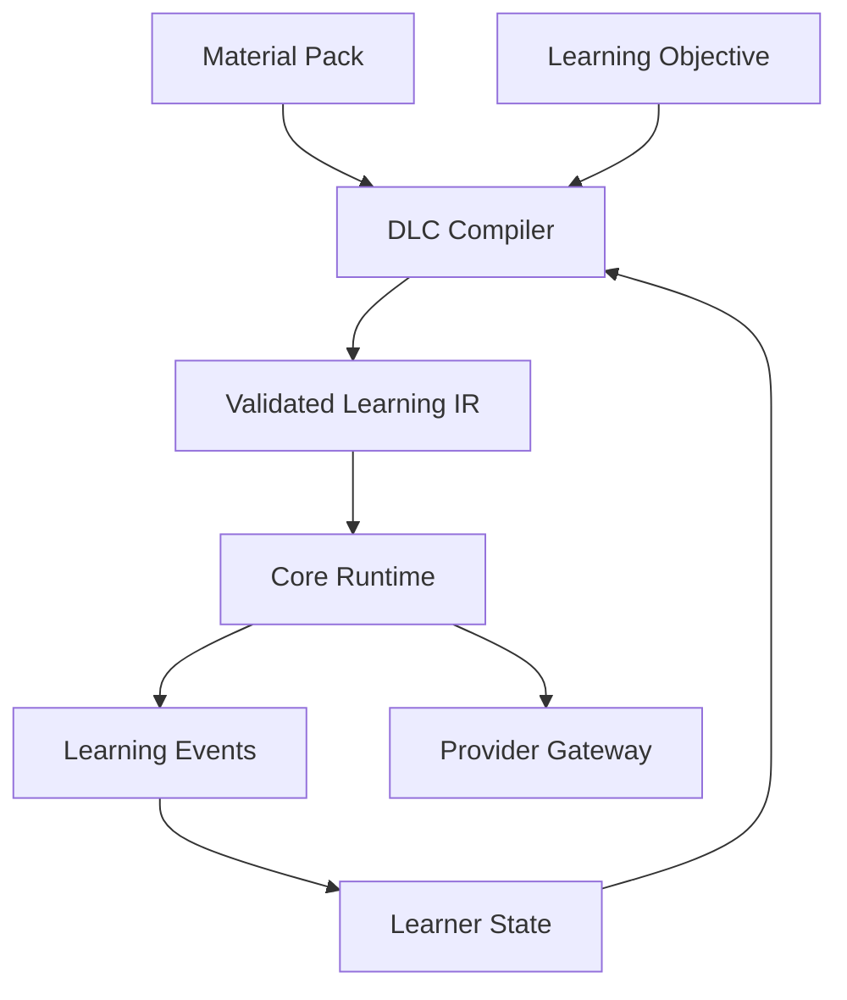

# 语言学习编译平台：本次对话完整整理与项目决策档案

> 归档日期：2026-08-14  
> 文档版本：0.1.0  
> 项目阶段：架构基线与核心契约已建立，等待现有工程映射及第一阶段实现  
> 归档范围：本次对话中提出的需求、发生的概念修正、最终确定的设计基调、已生成产物、验收方式及尚未完成事项。

本文件是按主题整理的完整项目档案，不是逐字聊天记录。它力求保留所有影响产品、架构和后续工作的内容，并明确区分“已经完成”“已作决定但尚未实现”与“仅提出、仍待专项研究”。

---

## 1. 对话起点：最初提出的三组工作

用户最初围绕 DeepSeek V4、Harness、Agent 与模型评价提出三组工作。

### 1.1 DeepSeek V4 涨价后的性能—成本变化

希望分析 API 定价提高后，不同使用习惯客户的成本结构是否发生显著变化，并特别关注三类任务：

1. 商业级项目的全栈代码开发；
2. 人文社科某领域的智能化、信息化学科地图；
3. 强逻辑、长上下文或复杂 context 情景。

目标不是只比较 benchmark 分数，而是观察：

- 不同用户调用频率、上下文长度、缓存习惯与工具调用习惯下的真实成本；
- 能力提升能否减少返工、重试和人工修复；
- 涨价后模型在价格—性能分布中的位置是否发生明显移动；
- 对商业项目而言，是 token 单价更重要，还是一次成功率、工具可靠性和上下文压缩更重要。

### 1.2 DeepSeek Harness 与其他 Agent 架构

希望详细理解 DeepSeek Harness 开源设计：

- 它与其他 AI Agent 的区别；
- 其他 Agent 常见设计路线；
- Harness 的能力边界、插件机制、事件机制和工具执行思路；
- 哪些设计值得语言学习系统借鉴。

### 1.3 Frontier Club 与强评价模型

希望总结截至对话日期的 frontier club，以及能力足够强的评价模型，尤其关注：

- 能否承担高质量 Judge/Evaluator；
- 是否适合代码、长上下文、强逻辑和开放答案评价；
- 成本、稳定性和可替换性。

### 1.4 当前完成状态

本次对话后来转向语言学习系统的工程基线，因此：

- Harness 的可借鉴架构思想已经进入主架构文档；
- DeepSeek V4 涨价后的定量成本分布尚未形成专项报告；
- frontier club 与强评价模型名单尚未形成截至当日的专项报告；
- 上述两项应作为独立、需要联网核价和复核发布日期的后续研究，不应被视为已经完成。

---

## 2. 产品概念的演进与关键纠正

### 2.1 最初的 Steam 本体＋DLC 比喻

用户希望产品在设计哲学上类似 Steam 游戏：

- **Core/本体**负责用户权限类型、账户记录、语言与文本服务、插件接口、DLC Studio 等；
- **DLC**可插拔，一开始曾举例为俄语或德语 DLC，并可承载 FSI、配价语法、构式语法等理论组合；
- 产品性价比应显著优于传统教师和传统网课。

### 2.2 对 DLC 概念的关键纠正

用户随后指出：DLC 不应该等同于“某种语言课程内容包”，而应该更像**编译器**。

具体内容，例如：

- 情景；
- 词汇；
- 人物；
- 文章；
- 音视频；
- 语料与主题；

可以由 LLM 随机生成，也可以由独立的素材层提供。用户在学习前选择：

```text
Material Pack + DLC
```

DLC 再依据语言学和教学理论，把素材编译成具体学习活动。

这一纠正成为整个系统最重要的架构基线：

> 素材回答“学什么情景和内容”，DLC 回答“如何把这些内容教给这个学习者”。

### 2.3 最终产品定义

项目最终被定义为：

> 一套语言学习编译平台，而不是聊天机器人加课程库。

其核心对象为：

- Core：特权运行时和学习事实来源；
- DLC：教学编译器；
- Material Pack：可替换素材源；
- Learning IR：Core、DLC、素材和执行器之间的稳定 ABI；
- Provider：LLM、ASR、TTS、对齐、评分和语言工具的可替换实现；
- Agent：只处理确实需要概率推理的有界任务。

---

## 3. 用户当前工程条件与角色分工

### 3.1 已有条件

- Demo 已经跑通，不需要本轮重新做 Demo；
- 第一版 LLM Gateway 准备用最廉价服务器进行实验；
- 语言和文字互转当前计划采用 Piper 与 Whisper；
- 不同能力层级的模型未来可以加入，并可能对应不同定价等级；
- 服务器尚未租用，因此当前不应提前写死实例规格；
- WorkBuddy 与 Trae 是主要开发工具；
- 多 Agent、多模型协作机制已经完成初步搭建。

### 3.2 当前困难

用户认为 WorkBuddy 与 Trae：

- 对长期协议理解不足；
- 多轮交流后仍容易误解系统本质；
- 缺少稳定、可机器执行的架构契约；
- 容易把概念性讨论直接变成错误代码结构。

因此需要一个比聊天提示更稳定的交付形式，使免费或低价编码资源能够持续复用同一事实来源。

### 3.3 本轮助手角色

用户明确希望助手：

- 定系统基调；
- 把问题系统化、工程化；
- 建立协议、架构边界和验收标准；
- 设计开源发音评价路线；
- 不承担后续大量重复编码，因为成本不合算。

对应分工为：

```text
本轮助手：架构、契约、风险边界、质量门、验收
WorkBuddy / Trae：在契约约束下进行繁重代码实现
用户：产品方向、优先级、资源投入和最终商业决策
```

---

## 4. 已确定的顶层架构



### 4.1 Core 的特权边界

只有 Core 可以最终拥有或写入：

- 身份、账户与用户权限；
- DLC/素材购买与授权；
- 学习会话生命周期；
- 追加式学习事件；
- 学习状态投影；
- 隐私同意、保留与删除；
- Provider 路由、费用计量和预算；
- 插件签名、兼容性、权限与撤销；
- 审计、回放、迁移和回滚。

DLC、Agent 与 Provider 都不得直接写用户掌握度或用户数据库。

### 4.2 DLC 的编译器定义

DLC 输入：

```text
Material Pack
+ Learner State Projection
+ Learning Objective
+ Device Capability
+ Cost Budget
+ Random Seed
```

DLC 输出：

```text
Validated Executable Learning Session IR
```

DLC 可以承载：

- FSI 式强化和重复训练；
- 配价语法；
- 构式语法；
- 任务型教学；
- 可理解输入；
- 翻译训练；
- 考试训练；
- 上述理论的有约束组合。

DLC 不应拥有具体固定素材，也不能绕过 Gateway 直接绑定某个模型。

### 4.3 Material Pack 的定义

Material Pack 保存：

- 场景、人物、关系和事件；
- 交际意图与语义事实；
- 词汇候选；
- 文章、对话、音频、视频和图像；
- 语域、等级和敏感内容标签；
- 来源、许可证和内容哈希；
- 允许生成、改写、翻译和再分发的范围。

同一 Material Pack 可以交给不同 DLC 编译，以生成完全不同的学习体验。

### 4.4 Learning IR 的定义

Learning IR 是稳定 ABI，建议分为：

1. Material IR：素材事实；
2. Pedagogical IR：教学目标、构式、配价、音系目标和活动计划；
3. Executable Session IR：运行时可以直接执行的活动、输入、评分器、分支和事件。

Core 不理解某个具体教学理论的全部内部逻辑，只验证并执行合规 IR。

---

## 5. 对 DeepSeek Harness 的实际借鉴方式

### 5.1 值得借鉴的部分

Harness 的价值不只是“开源 Agent”，而是帮助形成以下工程习惯：

- 能力通过 seam/接口暴露，而不是直接写死供应商；
- 插件有生命周期、版本与边界；
- 工具执行经过 guard、pre、execute、post 等阶段；
- session log 和事件使过程可追踪、可回放；
- 编排器与具体能力实现分离；
- 插件组合由宿主控制，而不是插件自行夺取权限。

这些思路可直接用于：

- DLC 编译 Pass；
- Material Pack 解析器；
- Provider Registry；
- Agent WorkItem/WorkResult；
- 发音评价流水线；
- 离线回放和成本审计。

### 5.2 不应照搬的部分

教育产品不应完整复制“everything is a plugin”。以下部分必须留在 Core：

- 身份与授权；
- 支付与购买记录；
- 学习事件；
- 学习状态 reducer；
- 隐私与删除；
- Provider 预算；
- 插件权限和签名。

此外，不采用无限自治 Agent，也不以多个 Agent 的自由群聊作为主协议。

### 5.3 最终结论

本项目真正需要借鉴 Harness 的地方，是：

> 可插拔能力、严格宿主、事件记录、工具守卫、稳定协议和可回放执行，而不是尽可能增加 Agent 数量。

---

## 6. Agent、模型、Service 与 Workflow 的严格区分

### 6.1 Service

完成确定性转换或专业模型推理，例如：

- Whisper ASR；
- Piper TTS；
- Silero VAD；
- MFA 强制对齐；
- GOP 计算；
- G2P；
- 形态分析；
- 词典查询。

Service 不拥有开放目标，不自行规划任务。

### 6.2 Model

模型是 Provider 内的一项部署资产。模型名、版本、量化和价格都不能成为领域架构本身。

### 6.3 Agent

只用于需要概率推理、但能够严格限制输入输出的任务，例如：

- 素材语义标注；
- 情景表层变体生成；
- 开放答案候选评价；
- 结构化错误解释；
- 离线质量审计。

### 6.4 Workflow

由 Core 定义的有向状态图，负责：

- 调度 Agent/Service；
- 超时、重试、取消和降级；
- 并行步骤；
- 预算；
- 分歧仲裁；
- 记录输入、输出、版本和成本。

### 6.5 类型化协作协议

Agent 接收 `WorkItem`，返回 `WorkResult`。

WorkItem 至少包含：

- 任务 ID 和类型；
- 输入 artifact 引用；
- 必需能力；
- 输出 schema；
- 调用、token、音频、延迟和费用预算；
- 明确权限和禁止动作；
- 幂等键和随机种子。

WorkResult 至少包含：

- completed/rejected/failed/uncertain/cancelled 状态；
- 输出 artifact；
- 证据；
- 置信度；
- 用量与费用；
- 诊断；
- Provider trace。

---

## 7. 语音功能与开源发音评价设计

### 7.1 问题背景

用户认为 ChatGPT 语音交互体验很强，但关键限制为：

- 官方没有提供可下载的完整语音模型权重；
- 自然对话能力不等于发音评价能力；
- 普通 ASR 不能可靠指出具体发音错误；
- 需要开源或可自建的发音评价方案。

### 7.2 语音能力必须拆开

“语音强”至少包含四个不同问题：

1. 自然交互：低延迟、可打断、自然轮次和 TTS；
2. 内容正确：用户是否说对词汇、构式和语法；
3. 发音准确：音素、词重音、漏读和插入；
4. 韵律流利：语速、停顿、节奏、F0、强度和完整度。

不能用一个模型或一个总分混合处理四类问题。

### 7.3 第一版开源语音链

```text
Silero VAD
→ Whisper / faster-whisper
→ 参考文本与语言专用词典/G2P
→ Montreal Forced Aligner
→ GOP / 后续 CTC-GOP
→ Praat / Parselmouth 声学特征
→ 语言专用校准器
→ PronunciationAssessment
→ 规则模板或受约束 LLM 解释
```

组件职责：

| 组件 | 职责 | 不能代替什么 |
|---|---|---|
| Silero VAD | 语音段和静音检测 | 不能评价音素 |
| Whisper/faster-whisper | transcript 与可懂度证据 | 不能单独判断发音正确 |
| Piper | 本地 TTS | 不能作为唯一母语标准 |
| MFA | 已知文本的词/音素边界 | 对齐成功不等于发音正确 |
| GOP/CTC | 音素声学匹配证据 | 原始分数不能直接展示给用户 |
| Praat/Parselmouth | 时长、F0、强度、formant、停顿 | 单一特征不能独立诊断 |
| 校准器 | 把多源证据转换成语言专用置信度 | 不同语言不能共用未经验证阈值 |
| LLM | 将结构化证据解释成反馈 | 不得修改证据与错误事实 |

### 7.4 三种评价模式

#### Mode A：朗读/跟读

已知参考文本，可以做最可靠的词/音素对齐，是第一版重点。

#### Mode B：受约束表达

允许多个正确答案。先解析用户实际说出的文本，再把内容评价和发音评价分开。

#### Mode C：自由表达

可以评价可懂度、流利度和部分韵律，但不能轻易宣称某个音素发错；证据不足必须弃权。

### 7.5 评价原则

- 所有问题必须关联证据和音频时间区间；
- 必须记录置信度；
- 必须允许 `uncertain` / `abstained`；
- 低误纠正率优先于高覆盖率；
- 不把“像母语者”设为唯一目标；
- 首先优化可懂度、稳定性和任务完成能力。

---

## 8. 语言优先级的最终决定

### 8.1 发布批次

用户最终明确：

1. **德语优先**；
2. **英语、法语、俄语为第二批次**。

此前主文档中“俄语产品优先”的内容已经修正。ADR-006 已改为接受状态：

> 德语首发，英语、法语和俄语第二批次。

### 8.2 英语的特殊地位

英语虽然不是首发语言，但可以利用 SpeechOcean762、Kaldi GOP 和 GOPT 等公开资源做离线工程验证。

英语 benchmark 的意义是验证：

- 数据管线；
- GOP/评分实现；
- 指标计算；
- 回放和校准流程。

英语验证通过不等于德语评分已经通过。

### 8.3 第二批语言原则

英语、法语和俄语可以共享：

- Core；
- Provider Gateway；
- Learning IR；
- PronunciationAssessment；
- 工作流和事件协议。

它们不能共享未经验证的：

- 声学阈值；
- 可接受变体规则；
- GOP 分数解释；
- 词重音规则；
- 校准器；
- 公平性结论。

---

## 9. 德语首版发音范围

### 9.1 首版训练模式

- 朗读；
- 跟读；
- 目标句型复述；
- 限定词汇的受约束回答。

### 9.2 首批可诊断特征

- 长短元音和相关音质，例如 `/iː/–/ɪ/`、`/uː/–/ʊ/`、`/eː/–/ɛ/`；
- 前圆唇元音 `/yː ʏ øː œ/`；
- `ich-Laut /ç/` 与 `ach-Laut /x/`；
- 词尾阻塞音清化；
- `/p t k/` 在目标位置的送气；
- 词重音；
- 弱读音节和常见 schwa 实现；
- 语速、停顿、完整度、重复、漏词和插词。

### 9.3 可接受变体层

第一版不能把所有差异都当作错误，尤其包括：

- 合法的不同 `/r/` 实现；
- 喉塞音差异；
- schwa 与成音节辅音变体；
- 地区和说话人变体；
- 不影响可懂度且不是当前 DLC 目标的次要口音特征。

只有当某个实现：

- 影响可懂度；
- 改变音位对立、词义或语法功能；
- 是系统性高频错误；
- 属于当前 DLC 的明确目标；

才应优先生成纠错。

### 9.4 德语评分证据

- 元音数量：时长，但必须按音素、音节、语速和说话人归一化；
- 元音音质：F1/F2 与声学模型证据；
- 辅音：GOP/CTC 与上下文规则；
- 词重音：F0、强度、时长和元音质量联合；
- 完整度：ASR 多候选、对齐覆盖率、插入/删除；
- 流利度：停顿、重复、语速和自我修正。

不能仅以时长判断长短元音，也不能仅以 F0 峰值判断词重音。

### 9.5 训练与校准路线

#### Stage 0：无训练基线

- 使用 MFA 德语声学模型、词典和 G2P；
- 建立母语参考分布；
- 使用保守阈值；
- 低置信度全部弃权。

#### Stage 1：人工校准

- 收集约 300–1,000 条覆盖目标音系现象的样本；
- 按学习者母语、设备和水平分层；
- 至少部分双人标注；
- 训练简单校准器；
- 优先降低 false correction rate。

#### Stage 2：产品数据闭环

- 仅在用户明确同意后收集；
- 匿名化并限制用途；
- 人工复核困难样本；
- 逐步训练 CTC-GOP 或多任务评分器。

#### Stage 3：开放表达

- 增加自由口语可懂度、流利度与韵律；
- 继续保留音素级弃权；
- 内容错误与发音错误分开。

### 9.6 主要官方资源

- [MFA German Acoustic Model v3.0.0](https://mfa-models.readthedocs.io/en/latest/acoustic/German/German%20MFA%20acoustic%20model%20v3_0_0.html)
- [MFA German Dictionary v3.0.0](https://mfa-models.readthedocs.io/en/latest/dictionary/German/German%20MFA%20dictionary%20v3_0_0.html)
- [MFA German G2P Model](https://mfa-models.readthedocs.io/en/latest/g2p/German/German%20MFA%20G2P%20model%20v2_0_0a.html)
- [Montreal Forced Aligner](https://github.com/MontrealCorpusTools/Montreal-Forced-Aligner)
- [faster-whisper](https://github.com/SYSTRAN/faster-whisper)
- [Piper](https://github.com/OHF-voice/piper1-gpl)
- [Silero VAD](https://github.com/snakers4/silero-vad)
- [Praat](https://www.fon.hum.uva.nl/praat/)
- [Parselmouth](https://github.com/YannickJadoul/Parselmouth)

---

## 10. Provider Gateway、廉价服务器与未来定价

### 10.1 当前原则

- 第一阶段优先本地、CPU 可运行、可量化和可缓存；
- Whisper 优先评估 faster-whisper INT8；
- Piper 作为本地 TTS Provider；
- ASR、TTS、对齐、评分和 LLM 全部经过 Gateway；
- 测试默认使用 Fake/Replay Provider，不消耗付费 API；
- 在 benchmark 前不购买或承诺特定服务器配置。

### 10.2 Provider Descriptor 应记录

- capability；
- 支持语言；
- 本地/远程/混合执行；
- 模型、版本和精度；
- CPU、内存、GPU、磁盘要求；
- 并发与超时；
- 价格及生效时间；
- 数据是否离开本机；
- 数据保留和训练用途；
- 代码、模型和数据许可证；
- 健康检查与 benchmark 引用。

### 10.3 租服务器前必须测量

- ASR real-time factor；
- TTS real-time factor；
- 冷启动；
- 常驻内存；
- 并发 1/2/4 的 p50/p95；
- ASR 与 TTS 同时运行的资源争用；
- 德语 WER/CER；
- 英语、法语、俄语辅助测试；
- 对齐成功率与耗时；
- 每分钟音频的 CPU/GPU 秒；
- 每个活跃学习小时的综合成本。

### 10.4 未来模型分级

不同能力模型和用户套餐可以以后加入，但当前只建设：

- capability request；
- quality floor；
- latency class；
- privacy class；
- budget；
- metering；
- fallback。

不在现阶段写死模型套餐、价格等级和商业售价。

---

## 11. 已生成的主架构文档

文件：`language-learning-platform-architecture-v0.1.md`  
当前内部版本：`0.1.1`

主要内容：

- 产品与架构原则；
- Core、DLC、Material Pack、Learning IR；
- Harness 借鉴与特权边界；
- Agent、Service、Model、Workflow 区分；
- 开源语音和发音评分架构；
- 德语第一版设计；
- 第二批语言上线门槛；
- Provider Gateway 与廉价服务器 benchmark；
- ADR-001 至 ADR-008；
- 推荐实施顺序；
- 当前明确不做的事项；
- 官方来源与修改规则。

语言优先级已经从旧的“俄语优先”更正为“德语首发”。

---

## 12. 已生成的编码 Agent 章程

文件：`AGENTS.md`

目的：让 WorkBuddy、Trae 和其他编码 Agent 在开始修改代码前先读取统一约束。

其主要规则包括：

- Core 是特权边界；
- DLC 是编译器；
- Learning IR 是 ABI；
- 模型是 Provider；
- Agent 必须有界；
- 学习事件才是事实；
- 评价必须可弃权；
- 所有边界使用 schema；
- 不得直接绑定供应商；
- 不得在测试中默认调用付费 API；
- 不得把 ASR 结果直接当发音评价；
- 不得在 benchmark 前声称“商业级”或选择服务器；
- 每次交付必须列出边界、修改、验证、兼容性、风险和下一步。

该文件还提供：

- 推荐模块边界；
- DLC 编译流程；
- Material Pack 规则；
- Gateway 规则；
- 德语发音边界；
- Agent 执行流程；
- 完成定义；
- 测试矩阵；
- 安全、隐私和许可证要求；
- 禁止模式；
- Agent 交付模板。

---

## 13. 已生成的六份 JSON Schema

所有 schema 使用 JSON Schema Draft 2020-12。

### 13.1 `learning-ir.schema.json`

约束：

- Pedagogical IR；
- Executable Session IR；
- 学习目标；
- 活动、输入、评分、分支和事件输出；
- Provider capability slot；
- 编译器、Pass 与来源；
- 随机种子和可重现性。

### 13.2 `dlc-manifest.schema.json`

约束：

- Core/Compiler Runtime 兼容性；
- 支持语言和发布级别；
- 教学理论的可操作声明；
- 编译 Pass；
- capability requirement；
- 权限和预算；
- quality gate；
- 依赖、冲突、包、许可证和完整性。

### 13.3 `material-pack.schema.json`

约束：

- 素材包类型、语言和等级；
- 语义框架；
- 参与者、事实和交际意图；
- 词汇候选；
- 媒体资产、哈希和许可证；
- 注释来源与置信度；
- LLM 生成范围和不可变路径；
- provenance 和完整性。

### 13.4 `provider-descriptor.schema.json`

约束：

- LLM、ASR、TTS、alignment、pronunciation scoring、prosody 和 linguistic tool；
- 本地/远程执行；
- 模型、语言和质量等级；
- 量化与硬件要求；
- 并发、超时和输入限制；
- 价格、生效日期与计价单位；
- 隐私、保留、训练用途和许可证；
- 健康检查。

### 13.5 `agent-work.schema.json`

同时定义：

- WorkItem；
- WorkResult；
- capability request；
- 权限与禁止动作；
- 预算；
- artifact；
- evidence；
- usage；
- diagnostics；
- provider trace。

### 13.6 `pronunciation-assessment.schema.json`

约束：

- 音频质量门；
- 参考文本和候选发音图；
- ASR 多候选；
- 对齐状态和覆盖率；
- 分维度评分；
- 词与音素时间段；
- GOP/CTC/时长/formant/F0/强度等证据；
- 德语专用问题类别；
- issue、confidence 和 feedback key；
- abstention；
- 语言画像、校准器和阈值版本；
- Pipeline provenance 与资源用量。

---

## 14. 已执行的验证

本轮产物已完成：

- 六份 JSON 的语法解析检查；
- 所有本地 `$ref` 解析检查；
- 六份 schema 内嵌示例的约束检查；
- Markdown 代码围栏成对检查；
- 旧的“俄语产品优先”残留检查；
- ZIP 内容完整性检查。

通过检查不代表业务实现已经完成，只代表当前契约文件内部结构可用作第一阶段开发基线。

---

## 15. 当前完整交付包

压缩包：`language-learning-platform-baseline-v0.1.1.zip`

包内结构：

```text
AGENTS.md
language-learning-platform-architecture-v0.1.md
contracts/
  agent-work.schema.json
  dlc-manifest.schema.json
  learning-ir.schema.json
  material-pack.schema.json
  pronunciation-assessment.schema.json
  provider-descriptor.schema.json
```

这表示压缩包包含**本轮全部交付物**，但不代表已经包含整个产品。当前不包含：

- 实际产品代码；
- LearningEvent schema；
- 德语语言画像的正式 schema/数据；
- 德语校准数据集；
- 人工标注规范；
- 服务器 benchmark；
- 已训练的发音校准器；
- 完整 DLC 实现；
- 商业套餐与定价。

---

## 16. 建议给 WorkBuddy/Trae 的第一条指令

```text
先完整读取 AGENTS.md、主架构规范和六份 JSON Schema。

第一阶段只审计现有工程与契约的差距，输出按风险排序的 gap report：
1. 当前模块与目标模块的映射；
2. 已符合与不符合的架构不变量；
3. 需要新增的适配器、验证器和迁移；
4. 现有 Demo 中越过 Core、绑定 Provider 或使用自由 JSON 的位置；
5. 最小、可回滚的实施顺序；
6. 每一步对应的测试和验收证据。

此任务不得修改架构、不得重构代码、不得新增模型依赖、不得调用付费 API。
```

该步骤的目的不是拖慢编码，而是在大量免费 Agent 代码生成前发现方向错误。

---

## 17. 不应等整个产品完成才验收

建议按阶段验收。

### Checkpoint 1：现有工程映射

交付：

- gap report；
- 模块映射；
- 风险排序；
- 最小实施计划。

### Checkpoint 2：最小编译链

至少跑通：

```text
Material Pack
→ DLC Manifest 加载
→ DLC Compiler Pass
→ Learning IR
→ Schema Validation
```

这一阶段不要求发音模型和复杂 LLM。

### Checkpoint 3：Core 执行与事件

至少完成：

- 执行一个可执行 Session IR；
- 生成追加式学习事件；
- reducer 重建学习状态；
- Fake/Replay Provider；
- 失败、超时、取消和重放。

### Checkpoint 4：德语语音基础链

至少完成：

- 音频质量门；
- VAD；
- faster-whisper；
- 德语词典/G2P；
- MFA 对齐；
- 结构化 PronunciationAssessment；
- 对齐失败和低置信度弃权。

### Checkpoint 5：德语校准与产品化

至少完成：

- 人工评分集；
- 语言画像；
- 校准器；
- false correction 测试；
- 学习者母语、设备和水平切片；
- 本地服务器 benchmark。

---

## 18. 第一次交回验收时需要提供的材料

完成最小编译链后，可以交回本助手验收。应同时提供：

- 项目源码、仓库链接或 ZIP；
- 使用的 commit ID；
- WorkBuddy/Trae 的 gap report；
- Material Pack 实例；
- DLC Manifest 实例；
- 实际生成的 Learning IR；
- schema 验证输出；
- 测试命令及完整结果；
- 失败路径和负面测试；
- 未遵循架构规范的地方；
- 新增 ADR 或待决问题；
- 任何真实 Provider 调用的费用和 trace。

验收重点：

- 契约是否真正处于边界；
- Core 权限是否被绕过；
- DLC 与素材是否真正分离；
- Provider 是否可替换；
- Agent 是否有界；
- 测试是否存在假通过；
- 过程是否可以重放；
- 是否把临时实现偷换成架构事实。

---

## 19. 已接受的架构决策摘要

| ADR | 决定 | 状态 |
|---|---|---|
| ADR-001 | Core＋DLC Compiler＋Material Pack | ACCEPTED |
| ADR-002 | Core 保持特权边界 | ACCEPTED |
| ADR-003 | 多 Agent 采用类型化工作流 | ACCEPTED |
| ADR-004 | 语音和模型能力采用 Provider seam | ACCEPTED |
| ADR-005 | 发音评价采用多源证据组合 | ACCEPTED |
| ADR-006 | 德语首发，英语/法语/俄语第二批 | ACCEPTED |
| ADR-007 | 第一阶段采用 VAD→ASR→文本工作流→TTS | ACCEPTED |
| ADR-008 | 复杂模型套餐与商业定价推迟 | DEFERRED |

---

## 20. 当前明确不做

- 不重做已经跑通的 Demo；
- 不把所有能力包装成 Agent；
- 不让 Agent 自己定义协议；
- 不让 DLC 或 Agent 直写学习状态；
- 不让业务逻辑绑定 DeepSeek、OpenAI 或其他具体模型品牌；
- 不用 Whisper 或 LLM 单独评分发音；
- 不把 Piper 当作唯一母语标准；
- 不在没有人工校准时承诺商业级准确度；
- 不在没有 benchmark 时租用或承诺服务器规格；
- 不在第一阶段实现复杂商业套餐；
- 不追求“纠正所有口音特征”；
- 不让测试默认消耗付费 API；
- 不让本助手承担后续大规模重复编码。

---

## 21. 尚待后续完成的工作

### 21.1 工程契约

- LearningEvent schema；
- Learner State Projection schema；
- 德语 Language Profile；
- 发音可接受变体规则格式；
- 人工标注协议；
- Calibration Report；
- Benchmark Result schema；
- ADR 模板与迁移规范。

### 21.2 第一阶段实现

- 现有 Demo gap audit；
- Registry；
- Schema Validator；
- DLC pass runner；
- 最小 Learning IR 执行器；
- Append-only Event Store；
- Fake/Replay Provider；
- 本地性能测试框架。

### 21.3 德语语音

- 许可证核查与模型固定；
- 德语词典/G2P 适配；
- MFA 对齐 Provider；
- GOP 或 CTC 基线；
- Praat/Parselmouth 特征提取；
- 德语人工校准集；
- false correction 和公平性切片。

### 21.4 原始研究任务

- DeepSeek V4 正式版定价变化的情景化成本模型；
- DeepSeek Harness 与其他开源 Agent 的系统对比；
- 截止研究当日的 frontier club；
- 足够强的 Judge/Evaluator 模型清单；
- 代码、学科地图和强逻辑长上下文三类任务的价格—性能分布。

这些内容需要在开展时重新核对官方定价、模型版本和发布日期。

---

## 22. 文件完整性记录

以下为本轮交付文件的 SHA-256：

```text
6a95f5df1acc1adb8b4f373e6b32f35c0b85bdde3e7b299cf0530705b6f856bc  AGENTS.md
857506c78d60efec24138fe15b4690d4f864b07737cdacc4f986cbd00dd1ac58  language-learning-platform-architecture-v0.1.md
2463ccaee6fa1fe2d4007024f6038aeff7b5eb647307bc5b41377c7a61b1326e  contracts/agent-work.schema.json
225e3d8f8d2c6bc4936dcf28e0389b68a8c669589e05a6f439303bea7162eecc  contracts/dlc-manifest.schema.json
e9d2f62530e2649bfc18c6b85ac468fd973e68549e4974905bfdfd573a1581e3  contracts/learning-ir.schema.json
03ac52f56e2bf8265948ddd2797dbf1023e75db97a9eb3e9b4a6f7879cd40335  contracts/material-pack.schema.json
303a18562c2d9433ac4e0e828a1e3078e1eed77b0d0c435d5344c09bb3e549e6  contracts/pronunciation-assessment.schema.json
0b417dffcc221f0da2b56c1b9ab371be238d1177a1b819b9c5b77ea884e81691  contracts/provider-descriptor.schema.json
e6221fbc6cb98743a1543c696f1351b4e76ea4f079d549055e00744ecc6939b6  language-learning-platform-baseline-v0.1.1.zip
```

若后续文件被修改，哈希变化是正常现象，但必须同时更新版本和变更记录。

---

## 23. 当前项目状态的一句话结论

> 产品方向、系统边界、德语首发策略、开源发音评价路线、编码 Agent 章程和六个核心契约已经确定；下一步不是继续讨论抽象定义，而是让免费编码 Agent 先完成现有工程映射，再实现最小可验证编译链，并在第一个 Checkpoint 交回验收。
